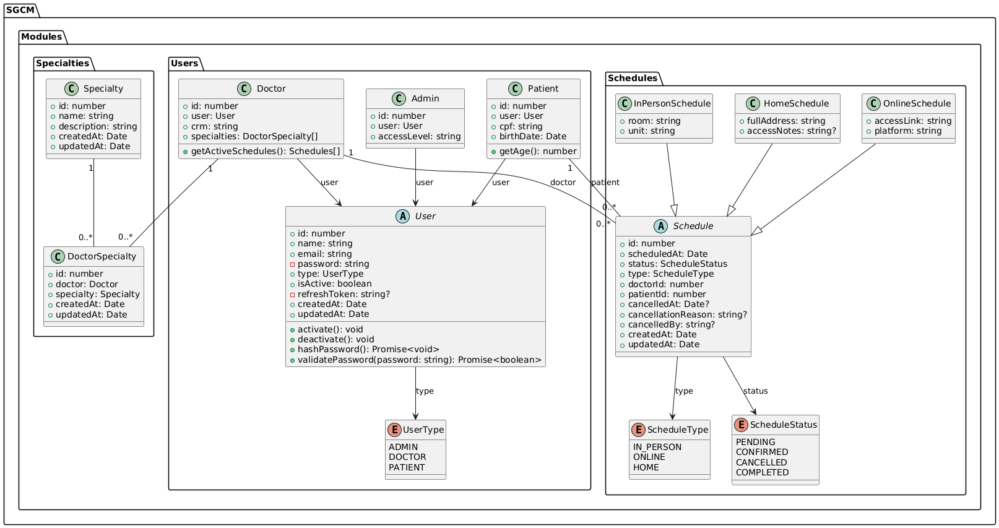

# Relatório Técnico — SGCM API

## 1 - INTEGRANTES E CONTRIBUIÇÕES

| Integrante | Contribuições nesta etapa |
|---|---|
| Arthur Coutinho | • Desenvolvimento da feature Doctors; <br> • Desenvolvimento da feature Specialties; <br> • Elaboração e organização da documentação Swagger; <br> • Criação e manutenção do diagrama PlantUML. |
| Estela Medeiros | • Desenvolvimento da feature Patients; <br> • Desenvolvimento da feature Schedules; <br> • Apoio técnico e revisão nas demais branches do projeto. |
| Gabriel Bressane | • Desenvolvimento do módulo Users; <br> • Implementação dos exception filters e tratamento global de erros; <br> • Elaboração da documentação técnica; <br> • Administração do repositório no GitHub, incluindo definição de regras e organização do fluxo de branches. |

> Todos os membros participaram das Pull Requests e colaboraram entre si sempre que necessário, realizando revisões de código, suporte técnico e auxílio na integração das funcionalidades.

## 2 - DIAGRAMA DE CLASSES



## 3 - DECISÕES TÉCNICAS

### 3.1 Estratégia de Herança: Por que escolhemos JTI

O modelo de usuários possui três subtipos — `Admin`, `Doctor` e `Patient` — cada um com atributos comuns (nome, e-mail, senha, tipo) e atributos específicos (`accessLevel`, `crm`, `cpf`/`birthDate`). Era necessário escolher uma estratégia de herança que equilibrasse normalização do schema e performance.

O JTI foi escolhido por oferecer o melhor equilíbrio para o contexto do SGCM:

- A tabela `user` responde consultas gerais (listagem, busca) sem nenhum JOIN
- JOINs com `doctor`, `patient` ou `admin` acontecem apenas quando os campos específicos são necessários
- Nenhuma coluna nula — cada tabela armazena exatamente o que lhe pertence
- Constraints `NOT NULL` e `UNIQUE` aplicáveis corretamente em cada tabela
- Alterações em campos comuns afetam apenas a tabela `user`

---

#### 3.1.1 Por que a implementação foi manual

O **TypeORM**, ORM utilizado no projeto com NestJS, **não oferece suporte nativo ao JTI**. As únicas estratégias suportadas nativamente são:

| Estratégia | Suporte no TypeORM |
|---|---|
| Single Table Inheritance | ✅ via `@TableInheritance` + `@ChildEntity` |
| Concrete Table Inheritance | ✅ via `@Entity` independente em cada classe |
| **Joined Table Inheritance** | ❌ não suportado |

O mecanismo `@TableInheritance` + `@ChildEntity` do TypeORM, apesar de nominalmente chamado de suporte a herança, implementa **exclusivamente STI** — todas as colunas de todas as subclasses vão para a mesma tabela.

Diante dessa limitação, a solução adotada foi **simular o JTI manualmente**, utilizando os recursos que o TypeORM oferece:

- A entidade `User` foi mantida com `@Entity('user')` como tabela base
- As entidades `Admin`, `Doctor` e `Patient` foram criadas como entidades **independentes** (sem `extends User`), cada uma com sua própria tabela contendo apenas seus atributos específicos
- O relacionamento entre as tabelas é feito via `@OneToOne` com `@JoinColumn`, estabelecendo a chave estrangeira (`userId`) que liga cada subtipo à tabela base
- A opção `cascade: true` garante que ao salvar um `Doctor`, por exemplo, o registro correspondente em `user` também é criado automaticamente
- A opção `eager: true` garante que os dados do `user` base são carregados automaticamente junto com os dados do subtipo

**Schema resultante:**

tabela user                          
| id | name  | email | type    | ... |
|----|-------|-------|---------|-----|
| 1  | João  | ...   | DOCTOR  |     |
| 2  | Maria | ...   | PATIENT |     |

tabela doctor             
| id | userId | crm        |
|----|--------|------------|
| 1  | 1      | CRM/SP-123 |

tabela patient
| id | userId | cpf      | birthDate  |
|----|--------|----------|------------|
| 1  | 2      | 123.456  | 1990-01-01 |

O processo de criação ficou centralizado no `UsersFactoryService`, que monta a entidade `User` base, aninha dentro do subtipo correto e persiste via repositório da subclasse — aproveitando o `cascade` para salvar as duas tabelas em uma única operação.

---

### 3.2 Separação de responsabilidades nos serviços

O módulo de usuários foi dividido em três serviços com responsabilidades distintas, evitando que um único serviço acumulasse lógica demais:

**`UsersService`** — orquestra as operações CRUD. Delega a criação de entidades para a factory e a verificação de unicidade para o serviço específico. É o único serviço exposto para outros módulos via `exports`.

**`UsersFactoryService`** — responsável exclusivamente por instanciar e persistir a entidade correta de acordo com o tipo do usuário. Encapsula a lógica de qual repositório usar e como montar o objeto antes de salvar. Essa separação evita um `switch` gigante espalhado pelo `UsersService`.

**`UsersUniquenessService`** — centraliza a verificação de unicidade de campos como `email`, `crm` e `cpf`. Sem esse serviço, essa lógica seria duplicada tanto no `create` quanto no `update`. Ele recebe um `currentUserId` opcional para ignorar o próprio registro ao validar atualizações, evitando falsos positivos de conflito.

---

### 3.3 Organização dos endpoints de usuários

Decisão adotada: controllers separados por contexto (`UsersController`, `DoctorsController` e `PatientsController`), em vez de concentrar tudo em um único controller.

Alternativas consideradas:

- Um único controller para todos os endpoints de usuários, incluindo rotas específicas de médicos e pacientes.
- Controllers separados por contexto de rota.

Por que a escolhida foi adotada:

- Rotas mais expressivas e alinhadas ao domínio (`/users`, `/doctors`, `/patients`).
- Navegação e manutenção do código mais simples, com responsabilidades mais claras por controller.
- Menor acoplamento entre regras gerais de usuário e regras específicas de médico/paciente.

Impacto na organização dos DTOs:

- DTOs gerais permanecem no módulo de usuários (ex.: criação e atualização de usuário base).
- DTOs específicos ficam agrupados por feature (Doctors, Patients, Specialties e Schedules), reduzindo confusão entre contratos.
- Reuso de DTOs entre módulos ocorre quando necessário, sem duplicar estruturas.

Impacto na documentação Swagger:

- A documentação ficou mais clara por separação de tags (`Users`, `Doctors`, `Patients`).
- Cada grupo de endpoints aparece com escopo bem definido, facilitando consumo por quem integra a API.
- Menor risco de ambiguidades em endpoints específicos, já que as rotas não dependem de interpretação por tipo dentro de uma única tag.

#### 3.3.1 Contrato explícito entre `/users?type=DOCTOR` e `/doctors`

Decisão adotada: cada uma tem propósito e payload distintos.

Definição de retorno por rota:

- `/users?type=DOCTOR`: retorna a visão base de identidade do usuário (dados comuns de `user`), sem enriquecimento de domínio.
- `/doctors`: retorna visão de domínio de médico, com dados específicos de doctor e relacionamento com especialidades.


---

### 3.4 Tratamento de erros com RFC 7807

As exceções seguem o padrão **RFC 7807 (Problem Details for HTTP APIs)**, implementado via `HttpExceptionFilter` global. Todas as respostas de erro retornam um objeto estruturado:

```json
{
  "type": "https://sgcm.example.com/problems/conflict",
  "title": "Conflito",
  "status": 409,
  "detail": "E-mail já existe",
  "instance": "/users",
  "method": "POST",
  "timestamp": "2026-05-02T20:42:15.312Z",
  "traceId": "2c75672e-2bf2-418b-921a-63016352a9c3"
}
```

O `traceId` gerado por UUID em cada requisição facilita o rastreamento de erros em logs. Exceções customizadas (`NotFoundException`, `ConflictException`, `ValidationException`) são lançadas nos serviços e capturadas centralmente pelo filtro, evitando tratamento de erro espalhado pelo código.

### 3.5 Feature Doctors
A feature **Doctors** tem relação íntima com **Users**: um doctor é, na prática, um user. Por isso, seus arquivos relacionados ficam dentro de `users`.

Outra relação importante de Doctors é com **Specialties**. Como specialties existem separadamente e não representam um user, elas ficam em outra pasta. Essa feature foi implementada um pouco depois, mas ainda em paralelo com Doctors, devido à relação de muitos-para-muitos entre doctors e specialties.

Durante o desenvolvimento dessa feature, decidiu-se criar uma pasta de controllers para melhor organização dos arquivos.

### 3.6 Feature Specialties
A feature **Specialties** foi desenvolvida depois que a estrutura de **Doctors** já estava pronta, já que não faz sentido existir uma especialidade sem um doctor associado.

Um ponto crítico que exigiu uma decisão não especificada no enunciado foi o endpoint `/doctors/{id}/specialties`, que não informa o identificador da especialidade. Para resolver isso, considerando que o nome da especialidade é único, a requisição HTTP passou a exigir no body um JSON com o campo `name`.

### 3.7 Dependências entre módulos (Users x Schedules x Appointments)

Decisão adotada: **não exportar o `UsersService` integralmente como contrato para outros módulos**. Em vez disso, manter uma interface de acesso mais específica ao domínio, por meio dos serviços especializados já expostos pelo `UsersModule` (`DoctorsService` e `PatientsService`) e seus métodos de validação/consulta.

Alternativas consideradas:

- Exportar apenas o `UsersService` completo para qualquer consumo externo.
- Exportar serviços especializados com foco no mínimo necessário para cada contexto.

Por que a escolhida foi adotada:

- Reduz exposição desnecessária de regras internas do módulo de usuários.
- Mantém o encapsulamento do domínio, evitando que módulos externos dependam de operações de CRUD que não precisam.
- Deixa explícito no código qual contexto está sendo consumido (doctor e patient), melhorando legibilidade arquitetural.

Impacto e evolução (Etapa 3):

- O `SchedulesModule` precisa validar existência de médico e paciente sem acoplar toda a lógica de usuários.
- O futuro `AppointmentsModule` poderá reutilizar o mesmo contrato de validação, mantendo consistência entre módulos.
- A tendência é centralizar a validação de referência de usuários em serviços de leitura específicos, evitando duplicação de regra e mantendo baixo custo de manutenção.

### 3.8 Repositório genérico ou repositório customizado

Decisão adotada: usar o `Repository<T>` genérico como padrão do projeto e criar repositório customizado apenas quando houver ganho real de clareza, reuso e isolamento de consulta.

Alternativas consideradas:

- Usar somente `Repository<T>` genérico em todos os casos.
- Criar repositórios customizados para a maior parte das entidades.

Por que a escolhida foi adotada:

- Nesta etapa, a maioria das operações é bem atendida por métodos nativos (`find`, `findOne`, `findAndCount`, `save`, `remove`).
- Evita proliferação de arquivos e abstrações prematuras.
- Mantém curva de manutenção menor para o time.

Critério de consistência adotado para todo o projeto:

- Permanecer com `Repository<T>` genérico quando a consulta for simples, local ao service e com baixo risco de duplicação.
- Evoluir para repositório customizado quando houver pelo menos um dos cenários:
  - Query complexa com múltiplos filtros/joins e regra de negócio de leitura não trivial.
  - Reuso da mesma consulta em mais de um service ou módulo.
  - Necessidade de encapsular detalhes de persistência para manter services focados em regra de negócio.

Impacto prático no SGCM:

- O `SchedulesService` pode começar com repositório genérico sem perda de qualidade.
- Consultas como conflito de horário e busca por intervalo de datas permanecem no service enquanto forem pontuais e legíveis.
- Se essas queries crescerem ou forem reutilizadas (por exemplo, também no `AppointmentsModule`), devem migrar para um repositório customizado para preservar coesão e reduzir duplicação.

### 3.9 DTOs específicos por subclasse de agendamento

Decisão adotada: utilizar **um único `CreateScheduleDto`** com os campos das três modalidades como opcionais, combinando validação condicional por `type` com validação de regras adicionais no service.

Alternativas consideradas:

- Um único DTO com todos os campos possíveis e validação condicional por tipo.
- DTOs separados por modalidade (`CreateInPersonScheduleDto`, `CreateOnlineScheduleDto`, `CreateHomeScheduleDto`).

Por que a escolhida foi adotada:

- Menor duplicação de campos comuns (`scheduledAt`, `doctorId`, `patientId`, `type`).
- Menor custo de manutenção de contrato na etapa atual.
- Implementação já consistente com `ValidateIf` no DTO e checagem de campos indevidos no `SchedulesService`.

Impacto no Swagger e na experiência de uso:

- O Swagger fica mais simples por ter um endpoint de criação com um único schema.
- Como contrapartida, o contrato exige leitura da regra de negócio por `type` para saber quais campos são obrigatórios em cada modalidade.
- Para reduzir ambiguidade, os campos estão documentados com exemplos e validações condicionais.

### 3.10 Validação de CPF

Decisão adotada: usar a biblioteca **`class-validator-cpf`** com o decorator **`@IsCPF()`**, validando o dígito verificador completo (não apenas formato).

Por que a escolhida foi adotada:

- Maior robustez contra dados inválidos com baixo custo de implementação.
- Reduz risco de erro em algoritmo manual e facilita manutenção.
- Integração direta com o fluxo de validação já usado no NestJS/class-validator.

Impacto no sistema:

- Entradas com CPF sintaticamente correto, mas inválido matematicamente, são rejeitadas.
- O CPF também é normalizado antes da validação (remoção de caracteres não numéricos), mantendo consistência de armazenamento e comparação.

### 3.11 Estratégia de herança para a hierarquia `User`

Decisão adotada: manter o modelo de **JTI (Joined Table Inheritance) implementado manualmente** no TypeORM/SQLite, com tabela base `user` e tabelas específicas para `doctor`, `patient` e `admin`.

Alternativas consideradas:

- STI (uma tabela única com colunas de todos os perfis).
- CTI (tabelas independentes por perfil com duplicação de campos comuns).

Justificativa técnica com foco em consultas e SQLite:

- As listagens globais de usuários (`/users`) consultam a tabela base `user` diretamente, sem necessidade de JOIN para dados comuns.
- Consultas específicas por perfil (`/doctors`, `/patients`) usam JOIN apenas quando necessário com as tabelas de subtipo.
- Em SQLite, essa abordagem mantém o schema mais normalizado e evita colunas nulas em massa, reduzindo ambiguidade de dados.
- Como o TypeORM não oferece JTI nativo, a implementação manual com relacionamentos 1:1 entrega o mesmo benefício estrutural com controle explícito das regras.

### 3.12 Remoção versus inativação de usuários

Decisão adotada: **inativação lógica**. O endpoint de remoção não exclui fisicamente o registro; ele altera `isActive` para `false`.

Alternativas consideradas:

- Remoção física do usuário.
- Inativação lógica com filtro nas consultas.

Por que a escolhida foi adotada:

- Preserva histórico e integridade de referências em agendamentos e demais módulos.
- Evita inconsistências futuras com atendimentos e auditoria de dados.

Onde a verificação ocorre no código:

- `UsersService.remove`: converte remoção em desativação (`isActive=false`).
- `UsersService.findAll` e `UsersService.findOne`: retornam apenas usuários ativos.
- `DoctorsService` e `PatientsService`: listagens e buscas por id consideram apenas perfis com `user.isActive=true`.
- `SchedulesService` (`findDoctorOrFail`/`findPatientOrFail`): valida apenas médico/paciente ativos para criação e atualização de agendamentos.

Comportamento definido:

- Usuário inativo não aparece em listagens.
- Busca por id de usuário inativo responde como não encontrado.
- Regra aplicada de forma consistente para todos os perfis de usuário.

### 3.13 Atualização parcial de usuários

Decisão adotada: atualização parcial com **subconjunto controlado de campos**.

Regras definidas:

- Permitido no endpoint de update geral: `name`, `email`, `accessLevel` e `crm` (quando aplicável ao perfil).
- **Não permitido** alterar `type` de usuário existente.
- **Não permitido** alterar `password` nesse endpoint.

Justificativa:

- Troca de tipo (`PATIENT` para `DOCTOR`, por exemplo) envolve mudança estrutural entre tabelas de subtipo e regras de consistência; não deve ocorrer por update comum.
- Atualização de senha exige fluxo dedicado (ex.: confirmação de credencial/token e regras de segurança específicas), separado do endpoint de perfil.
- DTOs de update foram ajustados para refletir essa política e rejeitar campos não permitidos pelo ValidationPipe (`whitelist` + `forbidNonWhitelisted`).

Impacto:

- Contrato de API mais explícito e seguro.
- Menor risco de corrupção de dados de perfil por atualização indevida.
- Preparação para evolução futura com endpoint dedicado de senha.

### 3.14 Relação muitos-para-muitos entre Doctor e Specialty

Decisão adotada: modelar a relação com entidade de junção explícita, por meio de `DoctorSpecialty`, em vez de usar apenas tabela de junção automática do TypeORM.

Por que a escolhida foi adotada:

- Mantém aderência ao diagrama de classes do projeto, que já prevê `DoctorSpecialty`.
- Dá maior controle sobre associação e desassociação, com validações e mensagens de erro específicas.
- Facilita evolução do domínio para incluir atributos na relação (por exemplo: data da associação, status, origem da vinculação) sem refatoração estrutural.

Impacto nos requisitos atuais e na evolução:

- Atende os requisitos atuais de associação/desassociação entre médico e especialidade com clareza de regra.
- Evita acoplamento excessivo da lógica de vínculo aos objetos principais.
- Reduz custo de evolução futura para a Etapa 3 e seguintes, mantendo a relação preparada para novas regras de negócio.

### 3.15 Estratégia de herança para `Schedule`

Decisão adotada: usar **STI (Single Table Inheritance)** para a hierarquia de agendamentos (`Schedule`, `InPersonSchedule`, `OnlineSchedule`, `HomeSchedule`) com `@TableInheritance` e `@ChildEntity`.

Por que a escolhida foi adotada:

- O sistema frequentemente precisa listar agendamentos misturados por modalidade (ex.: agenda do médico), e o STI simplifica essa consulta em uma tabela única.
- Reduz complexidade de JOINs/unions para operações de leitura geral.
- Para o cenário atual em SQLite com TypeORM, STI tem suporte nativo e implementação direta.
- Esse custo foi considerado aceitável nesta etapa devido ao ganho de simplicidade em listagem e paginação unificada.

### 3.16 Regra de conflito de horário

Decisão adotada: conflito ocorre quando existe **outro agendamento CONFIRMED com o mesmo `doctorId` e o mesmo `scheduledAt`**.

Onde a verificação ocorre:

- No `SchedulesService`, método `assertNoConfirmedConflict`.
- Antes da criação de agendamento.
- Na transição de status para `CONFIRMED`.
- Em atualização de agendamento já confirmado quando data/médico mudam.

Justificativa:

- Regra objetiva e determinística para o estágio atual do projeto.
- Evita sobreposição de consultas confirmadas do mesmo médico no mesmo instante.
- A proteção atual é em nível de service (checagem prévia em banco), o que cobre o fluxo comum.

### 3.17 Preenchimento de `cancelledBy` antes da autenticação

Decisão adotada nesta etapa: qualquer requisição pode cancelar, e o campo `cancelledBy` é preenchido com o valor informado no DTO ou, na ausência, com `SYSTEM`.

Regras atuais:

- `cancellationReason` e `cancelledBy` só podem ser enviados quando o status é `CANCELLED`.
- Ao cancelar, o sistema grava `cancelledAt` automaticamente.

Evolução para a Etapa 2 (com autenticação):

- `cancelledBy` deixará de vir livremente do payload.
- O valor passará a ser derivado do usuário autenticado no contexto da requisição (ex.: `PATIENT:<id>`, `DOCTOR:<id>`, `ADMIN:<id>` ou identificação equivalente).
- O endpoint deverá validar autorização de cancelamento por perfil/regra de negócio.

### 3.18 DTO único versus DTOs por modalidade em agendamentos

Decisão adotada: manter **DTO único** (`CreateScheduleDto`) com validação condicional (`ValidateIf`) por `type`, combinada com validação adicional no service para rejeitar campos incompatíveis com a modalidade.

Justificativa da escolha atual:

- Contrato único simplifica o endpoint de criação e reduz duplicação dos campos comuns.
- Implementação atual já está consistente no DTO e no `SchedulesService`.
- Mantém custo de manutenção menor nesta etapa.

Impacto no Swagger:

- Documentação mais simples por endpoint único.
- Menor precisão semântica que uma união discriminada formal, compensada por exemplos e validações condicionais.

### 3.19 Diferenciação de criação por perfil em `POST /users`

Decisão adotada: usar o padrão **Factory** em classe auxiliar (`UsersFactoryService`) para decidir, a partir de `type`, qual subtipo será instanciado e persistido.

Onde a decisão reside no código:

- `UsersController` permanece enxuto e apenas delega a chamada ao service.
- `UsersService` orquestra validações de regra de negócio (ex.: unicidade) e delega a criação para a factory.
- `UsersFactoryService` concentra o `switch` por `type` e a montagem/persistência de `Admin`, `Doctor` e `Patient`.

Justificativa:

- Mantém separação de responsabilidades e reduz acoplamento do controller com detalhes de persistência.
- Evita crescimento de complexidade no service principal de usuários.
- Facilita manutenção do fluxo de criação por perfil em um único ponto.


---

## 4 - DIFICULDADES E APRENDIZADOS

## Conclusão

A escolha pelo JTI foi técnica e consciente: o schema resultante é mais limpo, normalizado e preparado para crescimento. O custo foi a necessidade de uma implementação manual, já que o TypeORM não oferece suporte nativo a essa estratégia. Essa abordagem exigiu um entendimento mais profundo tanto do ORM quanto do modelo relacional, mas resultou em uma arquitetura mais robusta e alinhada com as boas práticas de modelagem de banco de dados.

As demais decisões — separação de serviços, validação condicional por tipo, hash na entidade, paginação padronizada e tratamento de erros RFC 7807 — refletem o mesmo princípio: soluções que isolam responsabilidades, reduzem duplicação e tornam o sistema mais fácil de evoluir e manter.