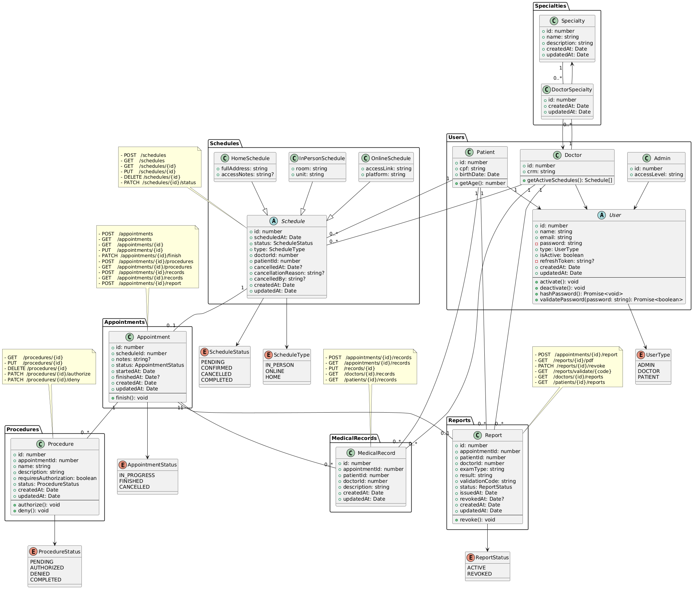
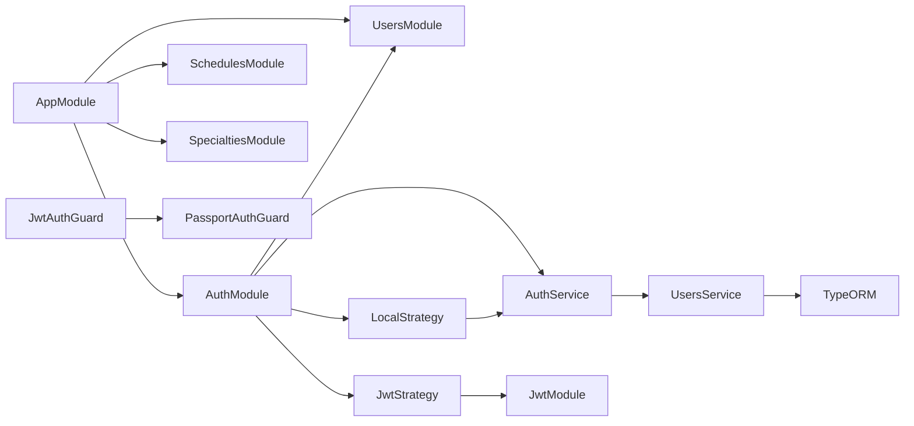

# Relatório Técnico — SGCM API

## Sumário

- [1 - Integrantes e contribuições](#1---integrantes-e-contribuições)
- [2 - Diagrama de classes](#2---diagrama-de-classes)
- [3 - Decisões técnicas](#3---decisões-técnicas)
- [4 - Dificuldades e aprendizados](#4---dificuldades-e-aprendizados)
- [Conclusão](#conclusão)

## 1 - INTEGRANTES E CONTRIBUIÇÕES

<table>
  <thead>
    <tr>
      <th>Integrante</th>
      <th>Contribuições</th>
      <th>Etapa</th>
    </tr>
  </thead>
  <tbody>
    <tr>
      <td rowspan="3"><b>Arthur Coutinho</b></td>
      <td>• Desenvolvimento da feature Doctors;<br>• Desenvolvimento da feature Specialties;<br>• Elaboração e organização da documentação Swagger.<br>• Criação e manutenção do diagrama PlantUML.</td>
      <td>1</td>
    </tr>
    <tr>
      <td>• Módulo de autenticação.</td>
      <td>2</td>
    </tr>
    <tr>
      <td>• Desenvolvimento do módulo Procedures;<br>• Desenvolvimento do módulo Prontuários.</td>
      <td>3</td>
    </tr>
    <tr>
      <td rowspan="3"><b>Estela Medeiros</b></td>
      <td>• Desenvolvimento da feature Patients;<br>• Desenvolvimento da feature Schedules.<br>• Apoio técnico e revisão nas demais branches do projeto.</td>
      <td>1</td>
    </tr>
    <tr>
      <td>• Módulo de autenticação.<br>• Guardas e controle de acesso.</td>
      <td>2</td>
    </tr>
    <tr>
      <td>• Desenvolvimento do módulo Appointments.</td>
      <td>3</td>
    </tr>
    <tr>
      <td rowspan="3"><b>Gabriel Bressane</b></td>
      <td>• Desenvolvimento do módulo Users;<br>• Implementação dos exception filters e tratamento global de erros.<br>• Elaboração da documentação técnica;<br>• Administração do repositório no GitHub.</td>
      <td>1</td>
    </tr>
    <tr>
      <td>• Expansão do exception filter;<br>• Implementação do transform interceptor;<br>• Implementação do logging middleware;<br>• Atualização e organização da documentação técnica.</td>
      <td>2</td>
    </tr>
    <tr>
      <td>• Desenvolvimento do módulo Reports;<br>• Desenvolvimento dos relatórios administrativos (Admin Reports);<br>• Atualização, revisão e organização da documentação técnica e Swagger.</td>
      <td>3</td>
    </tr>

  </tbody>
</table>


> Todos os membros participaram das Pull Requests e colaboraram entre si sempre que necessário, realizando revisões de código, suporte técnico e auxílio na integração das funcionalidades.

## 2 - DIAGRAMA DE CLASSES



## 3 - DECISÕES TÉCNICAS

## ETAPA 1

### 3.1 Estratégia de Herança: Por que escolhemos JTI

O modelo de usuários possui três subtipos — `Admin`, `Doctor` e `Patient` — cada um com atributos comuns (nome, e-mail, senha, tipo) e atributos específicos (`accessLevel`, `crm`, `cpf`/`birthDate`). Era necessário escolher uma estratégia de herança que equilibrasse normalização do schema e performance.

O JTI foi escolhido por oferecer o melhor equilíbrio para o contexto do SGCM:

- A tabela `user` responde consultas gerais (listagem, busca) sem nenhum JOIN
- JOINs com `doctor`, `patient` ou `admin` acontecem apenas quando os campos específicos são necessários
- Nenhuma coluna nula — cada tabela armazena exatamente o que lhe pertence
- Constraints `NOT NULL` e `UNIQUE` aplicáveis corretamente em cada tabela
- Alterações em campos comuns afetam apenas a tabela `user`

---

#### 3.1.1 Por que a implementação foi manual

O **TypeORM**, ORM utilizado no projeto com NestJS, **não oferece suporte nativo ao JTI**. As únicas estratégias suportadas nativamente são:

| Estratégia | Suporte no TypeORM |
|---|---|
| Single Table Inheritance | ✅ via `@TableInheritance` + `@ChildEntity` |
| Concrete Table Inheritance | ✅ via `@Entity` independente em cada classe |
| **Joined Table Inheritance** | ❌ não suportado |

O mecanismo `@TableInheritance` + `@ChildEntity` do TypeORM, apesar de nominalmente chamado de suporte a herança, implementa **exclusivamente STI** — todas as colunas de todas as subclasses vão para a mesma tabela.

Diante dessa limitação, a solução adotada foi **simular o JTI manualmente**, utilizando os recursos que o TypeORM oferece:

- A entidade `User` foi mantida com `@Entity('user')` como tabela base
- As entidades `Admin`, `Doctor` e `Patient` foram criadas como entidades **independentes** (sem `extends User`), cada uma com sua própria tabela contendo apenas seus atributos específicos
- O relacionamento entre as tabelas é feito via `@OneToOne` com `@JoinColumn`, estabelecendo a chave estrangeira (`userId`) que liga cada subtipo à tabela base
- A opção `cascade: true` garante que ao salvar um `Doctor`, por exemplo, o registro correspondente em `user` também é criado automaticamente
- A opção `eager: true` garante que os dados do `user` base são carregados automaticamente junto com os dados do subtipo

**Schema resultante:**

tabela user                          
| id | name  | email | type    | ... |
|----|-------|-------|---------|-----|
| 1  | João  | ...   | DOCTOR  |     |
| 2  | Maria | ...   | PATIENT |     |

tabela doctor             
| id | userId | crm        |
|----|--------|------------|
| 1  | 1      | CRM/SP-123 |

tabela patient
| id | userId | cpf      | birthDate  |
|----|--------|----------|------------|
| 1  | 2      | 123.456  | 1990-01-01 |

O processo de criação ficou centralizado no `UsersFactoryService`, que monta a entidade `User` base, aninha dentro do subtipo correto e persiste via repositório da subclasse — aproveitando o `cascade` para salvar as duas tabelas em uma única operação.

---

### 3.2 Separação de responsabilidades nos serviços

O módulo de usuários foi dividido em três serviços com responsabilidades distintas, evitando que um único serviço acumulasse lógica demais:

**`UsersService`** — orquestra as operações CRUD. Delega a criação de entidades para a factory e a verificação de unicidade para o serviço específico. É o único serviço exposto para outros módulos via `exports`.

**`UsersFactoryService`** — responsável exclusivamente por instanciar e persistir a entidade correta de acordo com o tipo do usuário. Encapsula a lógica de qual repositório usar e como montar o objeto antes de salvar. Essa separação evita um `switch` gigante espalhado pelo `UsersService`.

**`UsersUniquenessService`** — centraliza a verificação de unicidade de campos como `email`, `crm` e `cpf`. Sem esse serviço, essa lógica seria duplicada tanto no `create` quanto no `update`. Ele recebe um `currentUserId` opcional para ignorar o próprio registro ao validar atualizações, evitando falsos positivos de conflito.

---

### 3.3 Organização dos endpoints de usuários

Decisão adotada: controllers separados por contexto (`UsersController`, `DoctorsController` e `PatientsController`), em vez de concentrar tudo em um único controller.

Alternativas consideradas:

- Um único controller para todos os endpoints de usuários, incluindo rotas específicas de médicos e pacientes.
- Controllers separados por contexto de rota.

Por que a escolhida foi adotada:

- Rotas mais expressivas e alinhadas ao domínio (`/users`, `/doctors`, `/patients`).
- Navegação e manutenção do código mais simples, com responsabilidades mais claras por controller.
- Menor acoplamento entre regras gerais de usuário e regras específicas de médico/paciente.

Impacto na organização dos DTOs:

- DTOs gerais permanecem no módulo de usuários (ex.: criação e atualização de usuário base).
- DTOs específicos ficam agrupados por feature (Doctors, Patients, Specialties e Schedules), reduzindo confusão entre contratos.
- Reuso de DTOs entre módulos ocorre quando necessário, sem duplicar estruturas.

Impacto na documentação Swagger:

- A documentação ficou mais clara por separação de tags (`Users`, `Doctors`, `Patients`).
- Cada grupo de endpoints aparece com escopo bem definido, facilitando consumo por quem integra a API.
- Menor risco de ambiguidades em endpoints específicos, já que as rotas não dependem de interpretação por tipo dentro de uma única tag.

#### 3.3.1 Contrato explícito entre `/users?type=DOCTOR` e `/doctors`

Decisão adotada: cada uma tem propósito e payload distintos.

Definição de retorno por rota:

- `/users?type=DOCTOR`: retorna a visão base de identidade do usuário (dados comuns de `user`), sem enriquecimento de domínio.
- `/doctors`: retorna visão de domínio de médico, com dados específicos de doctor e relacionamento com especialidades.


---

### 3.4 Tratamento de erros com RFC 7807

As exceções seguem o padrão **RFC 7807 (Problem Details for HTTP APIs)**, implementado via `HttpExceptionFilter` global. Todas as respostas de erro retornam um objeto estruturado:

```json
{
  "type": "https://sgcm.example.com/problems/conflict",
  "title": "Conflito",
  "status": 409,
  "detail": "E-mail já existe",
  "instance": "/users",
  "method": "POST",
  "timestamp": "2026-05-02T20:42:15.312Z",
  "traceId": "2c75672e-2bf2-418b-921a-63016352a9c3"
}
```

O `traceId` gerado por UUID em cada requisição facilita o rastreamento de erros em logs. Exceções customizadas (`NotFoundException`, `ConflictException`, `ValidationException`) são lançadas nos serviços e capturadas centralmente pelo filtro, evitando tratamento de erro espalhado pelo código.

#### 3.4.1 Como o projeto implementa o tratamento de erros hoje

Nesta etapa, o tratamento é centralizado no `HttpExceptionFilter` global registrado em `main.ts`, com resposta padronizada em Problem Details (RFC 7807).

Mapeamento atualmente implementado:

- `NotFoundException` (domínio ou Nest): `404` com `type` de recurso não encontrado.
- `BadRequestException` (incluindo falhas de validação do ValidationPipe): `400` com detalhes de campos inválidos quando disponíveis.
- `ConflictException` de domínio: `409` com mensagem de regra de negócio/duplicidade.
- `ForbiddenException`: `403` (preparado para uso da Etapa 2).
- `UnauthorizedException`: `401` (preparado para uso da Etapa 2).
- `QueryFailedError` do TypeORM: convertido para erro semântico de domínio, retornando `409` para conflitos de constraint e `400` para erros de validação/driver.
- Exceções não previstas: `500` com mensagem segura e genérica.

Campos padrão retornados em todas as respostas de erro:

- `type`
- `title`
- `status`
- `detail`
- `instance`
- `method`
- `timestamp`
- `traceId`

Com isso, o cliente da API recebe sempre um contrato consistente de erro, independentemente do ponto da aplicação onde a exceção foi lançada.

#### 3.4.2 Revisão crítica do filtro da Etapa 1

Ao revisar o filtro existente, foi confirmado que ele já interceptava os principais cenários da aplicação por meio de um `HttpExceptionFilter` global:

- erros de validação do `ValidationPipe`, convertidos para `400` em formato RFC 7807;
- `NotFoundException` e demais `HttpException` do Nest;
- conflitos do TypeORM convertidos em `409`;
- erros inesperados, convertidos em `500` com mensagem segura.

Os pontos ajustados nesta etapa foram:

- expansão explícita do tratamento de `UnauthorizedException` e `ForbiddenException` no contrato da aplicação;
- padronização dos títulos de erro para `401` e `403`;
- preenchimento consistente do campo `instance` com o caminho da requisição;
- diferenciação entre ambiente de desenvolvimento e produção para erros inesperados, exibindo mais detalhe em desenvolvimento e mensagem genérica em produção.

#### 3.4.3 Política de mensagens para autenticação e autorização

Foi adotada uma política híbrida:

- `401` de token ausente, expirado, inválido ou refresh token rejeitado recebem mensagens específicas, porque ajudam o cliente legítimo a corrigir a ação necessária sem expor dados sensíveis adicionais;
- falhas de login por e-mail/senha usam mensagem genérica (`E-mail ou senha incorretos.`), para evitar enumeração de usuários;
- acesso a recurso de outro usuário deve ser tratado com `403 Acesso negado`, com mensagem genérica de permissão;
- se um usuário for inativado depois da emissão do token, a sessão passa a ser tratada como inválida e retorna `401`, em vez de expor detalhes sobre a conta.

Essa decisão mantém o fluxo usável para quem está autenticado corretamente e reduz o risco de revelar informações úteis para ataques de enumeração ou análise de permissões.

### 3.5 Feature Doctors
A feature **Doctors** tem relação íntima com **Users**: um doctor é, na prática, um user. Por isso, seus arquivos relacionados ficam dentro de `users`.

Outra relação importante de Doctors é com **Specialties**. Como specialties existem separadamente e não representam um user, elas ficam em outra pasta. Essa feature foi implementada um pouco depois, mas ainda em paralelo com Doctors, devido à relação de muitos-para-muitos entre doctors e specialties.

Durante o desenvolvimento dessa feature, decidiu-se criar uma pasta de controllers para melhor organização dos arquivos.

### 3.6 Feature Specialties
A feature **Specialties** foi desenvolvida depois que a estrutura de **Doctors** já estava pronta, já que não faz sentido existir uma especialidade sem um doctor associado.

Um ponto crítico que exigiu uma decisão não especificada no enunciado foi o endpoint `/doctors/{id}/specialties`, que não informa o identificador da especialidade. Para resolver isso, considerando que o nome da especialidade é único, a requisição HTTP passou a exigir no body um JSON com o campo `name`.

### 3.7 Dependências entre módulos (Users x Schedules x Appointments)

Decisão adotada: **não exportar o `UsersService` integralmente como contrato para outros módulos**. Em vez disso, manter uma interface de acesso mais específica ao domínio, por meio dos serviços especializados já expostos pelo `UsersModule` (`DoctorsService` e `PatientsService`) e seus métodos de validação/consulta.

Alternativas consideradas:

- Exportar apenas o `UsersService` completo para qualquer consumo externo.
- Exportar serviços especializados com foco no mínimo necessário para cada contexto.

Por que a escolhida foi adotada:

- Reduz exposição desnecessária de regras internas do módulo de usuários.
- Mantém o encapsulamento do domínio, evitando que módulos externos dependam de operações de CRUD que não precisam.
- Deixa explícito no código qual contexto está sendo consumido (doctor e patient), melhorando legibilidade arquitetural.

Impacto e evolução (Etapa 3):

- O `SchedulesModule` precisa validar existência de médico e paciente sem acoplar toda a lógica de usuários.
- O futuro `AppointmentsModule` poderá reutilizar o mesmo contrato de validação, mantendo consistência entre módulos.
- A tendência é centralizar a validação de referência de usuários em serviços de leitura específicos, evitando duplicação de regra e mantendo baixo custo de manutenção.

### 3.8 Repositório genérico ou repositório customizado

Decisão adotada: usar o `Repository<T>` genérico como padrão do projeto e criar repositório customizado apenas quando houver ganho real de clareza, reuso e isolamento de consulta.

Alternativas consideradas:

- Usar somente `Repository<T>` genérico em todos os casos.
- Criar repositórios customizados para a maior parte das entidades.

Por que a escolhida foi adotada:

- Nesta etapa, a maioria das operações é bem atendida por métodos nativos (`find`, `findOne`, `findAndCount`, `save`, `remove`).
- Evita proliferação de arquivos e abstrações prematuras.
- Mantém curva de manutenção menor para o time.

Critério de consistência adotado para todo o projeto:

- Permanecer com `Repository<T>` genérico quando a consulta for simples, local ao service e com baixo risco de duplicação.
- Evoluir para repositório customizado quando houver pelo menos um dos cenários:
  - Query complexa com múltiplos filtros/joins e regra de negócio de leitura não trivial.
  - Reuso da mesma consulta em mais de um service ou módulo.
  - Necessidade de encapsular detalhes de persistência para manter services focados em regra de negócio.

Impacto prático no SGCM:

- O `SchedulesService` pode começar com repositório genérico sem perda de qualidade.
- Consultas como conflito de horário e busca por intervalo de datas permanecem no service enquanto forem pontuais e legíveis.
- Se essas queries crescerem ou forem reutilizadas (por exemplo, também no `AppointmentsModule`), devem migrar para um repositório customizado para preservar coesão e reduzir duplicação.

### 3.9 DTOs específicos por subclasse de agendamento

Decisão adotada: utilizar **um único `CreateScheduleDto`** com os campos das três modalidades como opcionais, combinando validação condicional por `type` com validação de regras adicionais no service.

Alternativas consideradas:

- Um único DTO com todos os campos possíveis e validação condicional por tipo.
- DTOs separados por modalidade (`CreateInPersonScheduleDto`, `CreateOnlineScheduleDto`, `CreateHomeScheduleDto`).

Por que a escolhida foi adotada:

- Menor duplicação de campos comuns (`scheduledAt`, `doctorId`, `patientId`, `type`).
- Menor custo de manutenção de contrato na etapa atual.
- Implementação já consistente com `ValidateIf` no DTO e checagem de campos indevidos no `SchedulesService`.

Impacto no Swagger e na experiência de uso:

- O Swagger fica mais simples por ter um endpoint de criação com um único schema.
- Como contrapartida, o contrato exige leitura da regra de negócio por `type` para saber quais campos são obrigatórios em cada modalidade.
- Para reduzir ambiguidade, os campos estão documentados com exemplos e validações condicionais.

### 3.10 Validação de CPF

Decisão adotada: usar a biblioteca **`class-validator-cpf`** com o decorator **`@IsCPF()`**, validando o dígito verificador completo (não apenas formato).

Por que a escolhida foi adotada:

- Maior robustez contra dados inválidos com baixo custo de implementação.
- Reduz risco de erro em algoritmo manual e facilita manutenção.
- Integração direta com o fluxo de validação já usado no NestJS/class-validator.

Impacto no sistema:

- Entradas com CPF sintaticamente correto, mas inválido matematicamente, são rejeitadas.
- O CPF também é normalizado antes da validação (remoção de caracteres não numéricos), mantendo consistência de armazenamento e comparação.

### 3.11 Estratégia de herança para a hierarquia `User`

Decisão adotada: manter o modelo de **JTI (Joined Table Inheritance) implementado manualmente** no TypeORM/SQLite, com tabela base `user` e tabelas específicas para `doctor`, `patient` e `admin`.

Alternativas consideradas:

- STI (uma tabela única com colunas de todos os perfis).
- CTI (tabelas independentes por perfil com duplicação de campos comuns).

Justificativa técnica com foco em consultas e SQLite:

- As listagens globais de usuários (`/users`) consultam a tabela base `user` diretamente, sem necessidade de JOIN para dados comuns.
- Consultas específicas por perfil (`/doctors`, `/patients`) usam JOIN apenas quando necessário com as tabelas de subtipo.
- Em SQLite, essa abordagem mantém o schema mais normalizado e evita colunas nulas em massa, reduzindo ambiguidade de dados.
- Como o TypeORM não oferece JTI nativo, a implementação manual com relacionamentos 1:1 entrega o mesmo benefício estrutural com controle explícito das regras.

### 3.12 Remoção versus inativação de usuários

Decisão adotada: **inativação lógica**. O endpoint de remoção não exclui fisicamente o registro; ele altera `isActive` para `false`.

Alternativas consideradas:

- Remoção física do usuário.
- Inativação lógica com filtro nas consultas.

Por que a escolhida foi adotada:

- Preserva histórico e integridade de referências em agendamentos e demais módulos.
- Evita inconsistências futuras com atendimentos e auditoria de dados.

Onde a verificação ocorre no código:

- `UsersService.remove`: converte remoção em desativação (`isActive=false`).
- `UsersService.findAll` e `UsersService.findOne`: retornam apenas usuários ativos.
- `DoctorsService` e `PatientsService`: listagens e buscas por id consideram apenas perfis com `user.isActive=true`.
- `SchedulesService` (`findDoctorOrFail`/`findPatientOrFail`): valida apenas médico/paciente ativos para criação e atualização de agendamentos.

Comportamento definido:

- Usuário inativo não aparece em listagens.
- Busca por id de usuário inativo responde como não encontrado.
- Regra aplicada de forma consistente para todos os perfis de usuário.

### 3.13 Atualização parcial de usuários

Decisão adotada: atualização parcial com **subconjunto controlado de campos**.

Regras definidas:

- Permitido no endpoint de update geral: `name`, `email`, `accessLevel` e `crm` (quando aplicável ao perfil).
- **Não permitido** alterar `type` de usuário existente.
- **Não permitido** alterar `password` nesse endpoint.

Justificativa:

- Troca de tipo (`PATIENT` para `DOCTOR`, por exemplo) envolve mudança estrutural entre tabelas de subtipo e regras de consistência; não deve ocorrer por update comum.
- Atualização de senha exige fluxo dedicado (ex.: confirmação de credencial/token e regras de segurança específicas), separado do endpoint de perfil.
- DTOs de update foram ajustados para refletir essa política e rejeitar campos não permitidos pelo ValidationPipe (`whitelist` + `forbidNonWhitelisted`).

Impacto:

- Contrato de API mais explícito e seguro.
- Menor risco de corrupção de dados de perfil por atualização indevida.
- Preparação para evolução futura com endpoint dedicado de senha.

### 3.14 Relação muitos-para-muitos entre Doctor e Specialty

Decisão adotada: modelar a relação com entidade de junção explícita, por meio de `DoctorSpecialty`, em vez de usar apenas tabela de junção automática do TypeORM.

Por que a escolhida foi adotada:

- Mantém aderência ao diagrama de classes do projeto, que já prevê `DoctorSpecialty`.
- Dá maior controle sobre associação e desassociação, com validações e mensagens de erro específicas.
- Facilita evolução do domínio para incluir atributos na relação (por exemplo: data da associação, status, origem da vinculação) sem refatoração estrutural.

Impacto nos requisitos atuais e na evolução:

- Atende os requisitos atuais de associação/desassociação entre médico e especialidade com clareza de regra.
- Evita acoplamento excessivo da lógica de vínculo aos objetos principais.
- Reduz custo de evolução futura para a Etapa 3 e seguintes, mantendo a relação preparada para novas regras de negócio.

### 3.15 Estratégia de herança para `Schedule`

Decisão adotada: usar **STI (Single Table Inheritance)** para a hierarquia de agendamentos (`Schedule`, `InPersonSchedule`, `OnlineSchedule`, `HomeSchedule`) com `@TableInheritance` e `@ChildEntity`.

Por que a escolhida foi adotada:

- O sistema frequentemente precisa listar agendamentos misturados por modalidade (ex.: agenda do médico), e o STI simplifica essa consulta em uma tabela única.
- Reduz complexidade de JOINs/unions para operações de leitura geral.
- Para o cenário atual em SQLite com TypeORM, STI tem suporte nativo e implementação direta.
- Esse custo foi considerado aceitável nesta etapa devido ao ganho de simplicidade em listagem e paginação unificada.

### 3.16 Regra de conflito de horário

Decisão adotada: conflito ocorre quando existe **outro agendamento CONFIRMED com o mesmo `doctorId` e o mesmo `scheduledAt`**.

Onde a verificação ocorre:

- No `SchedulesService`, método `assertNoConfirmedConflict`.
- Antes da criação de agendamento.
- Na transição de status para `CONFIRMED`.
- Em atualização de agendamento já confirmado quando data/médico mudam.

Justificativa:

- Regra objetiva e determinística para o estágio atual do projeto.
- Evita sobreposição de consultas confirmadas do mesmo médico no mesmo instante.
- A proteção atual é em nível de service (checagem prévia em banco), o que cobre o fluxo comum.

### 3.17 Preenchimento de `cancelledBy` antes da autenticação

Decisão adotada nesta etapa: qualquer requisição pode cancelar, e o campo `cancelledBy` é preenchido com o valor informado no DTO ou, na ausência, com `SYSTEM`.

Regras atuais:

- `cancellationReason` e `cancelledBy` só podem ser enviados quando o status é `CANCELLED`.
- Ao cancelar, o sistema grava `cancelledAt` automaticamente.

Evolução para a Etapa 2 (com autenticação):

- `cancelledBy` deixará de vir livremente do payload.
- O valor passará a ser derivado do usuário autenticado no contexto da requisição (ex.: `PATIENT:<id>`, `DOCTOR:<id>`, `ADMIN:<id>` ou identificação equivalente).
- O endpoint deverá validar autorização de cancelamento por perfil/regra de negócio.

### 3.18 DTO único versus DTOs por modalidade em agendamentos

Decisão adotada: manter **DTO único** (`CreateScheduleDto`) com validação condicional (`ValidateIf`) por `type`, combinada com validação adicional no service para rejeitar campos incompatíveis com a modalidade.

Justificativa da escolha atual:

- Contrato único simplifica o endpoint de criação e reduz duplicação dos campos comuns.
- Implementação atual já está consistente no DTO e no `SchedulesService`.
- Mantém custo de manutenção menor nesta etapa.

Impacto no Swagger:

- Documentação mais simples por endpoint único.
- Menor precisão semântica que uma união discriminada formal, compensada por exemplos e validações condicionais.

### 3.19 Diferenciação de criação por perfil em `POST /users`

Decisão adotada: usar o padrão **Factory** em classe auxiliar (`UsersFactoryService`) para decidir, a partir de `type`, qual subtipo será instanciado e persistido.

Onde a decisão reside no código:

- `UsersController` permanece enxuto e apenas delega a chamada ao service.
- `UsersService` orquestra validações de regra de negócio (ex.: unicidade) e delega a criação para a factory.
- `UsersFactoryService` concentra o `switch` por `type` e a montagem/persistência de `Admin`, `Doctor` e `Patient`.

Justificativa:

- Mantém separação de responsabilidades e reduz acoplamento do controller com detalhes de persistência.
- Evita crescimento de complexidade no service principal de usuários.
- Facilita manutenção do fluxo de criação por perfil em um único ponto.


## ETAPA 2

### 3.20 Uso de interfaces e utils para paginação

Nessa etapa, a separação em `interfaces` e `utils` foi adotada para tornar o contrato de paginação mais explícito, reutilizável e desacoplado da lógica do interceptor.

As `interfaces` concentram exclusivamente a definição estrutural dos dados, em [paginated-response.interface.ts](src/common/interfaces/paginated-response.interface.ts) e [pagination-meta.interface.ts](src/common/interfaces/pagination-meta.interface.ts), mantendo a tipagem centralizada e reutilizável entre diferentes módulos da aplicação. Já a pasta `utils` reúne a função [is-paginated-response.util.ts](src/common/utils/is-paginated-response.util.ts), responsável por validar se o payload recebido corresponde a uma resposta paginada antes do processamento realizado pelo [TransformInterceptor](src/common/interceptors/transform.interceptor.ts).

Essa abordagem reduz acoplamento, melhora a legibilidade do código e facilita manutenção futura, além de manter o interceptor focado apenas na orquestração e padronização das respostas HTTP.

### 3.21 Campos extras no logging middleware

No logging middleware da Etapa 2, foram adicionados dois campos extras ao log: `event` e `completed`. Eles foram incluídos para diferenciar o fechamento normal da resposta (`finish`) do encerramento da conexão (`close`) e para deixar explícito, no registro, se a requisição foi concluída com sucesso ou interrompida antes do término completo.

O campo `event` informa qual evento disparou o log, permitindo identificar o ciclo de vida da requisição com mais clareza. Já o campo `completed` funciona como um resumo semântico desse estado: quando está `true`, a resposta terminou normalmente; quando está `false`, a conexão foi encerrada antes da finalização total. Isso melhora a rastreabilidade e ajuda na investigação de requisições abortadas, falhas de rede ou cancelamentos feitos pelo cliente.

```json
{
  "timestamp": "2026-05-21T19:25:19.308Z",
  "method": "GET",
  "url": "/patients",
  "ip": "::1",
  "statusCode": 401,
  "durationMs": 9,
  // Novos campos adicionados
  "event": "finish",
  "completed": true
}
```

#### 3.21.1 Captura de tempo e status no middleware

Decisão adotada no SGCM: capturar o tempo total de processamento e o status HTTP no próprio middleware, usando os eventos `finish` e `close` do objeto `Response`.

Como funciona:

- o middleware registra o instante inicial com `Date.now()` antes de chamar `next()`;
- depois, ele escuta `response.on('finish')` para saber quando a resposta foi enviada com sucesso;
- também escuta `response.on('close')` para registrar encerramentos prematuros da conexão;
- no callback, calcula `durationMs` como a diferença entre o tempo atual e o instante inicial;
- o `statusCode` é lido do próprio `response` no momento do evento, sem bloquear o pipeline.

Trecho atual:

Arquivo: [src/common/middlewares/logging.middleware.ts](src/common/middlewares/logging.middleware.ts)

```ts
const startedAt = Date.now();

const writeLog = (event: 'finish' | 'close'): void => {
  if (logWritten) {
    return;
  }

  logWritten = true;

  const durationMs = Date.now() - startedAt;
  const statusCode = response.statusCode;

  const logEntry = {
    timestamp,
    method,
    url,
    ip,
    statusCode,
    durationMs,
    event,
    completed: event === 'finish',
  };

  this.logger.log(JSON.stringify(logEntry, null, 2));
};

response.on('finish', () => writeLog('finish'));
response.on('close', () => writeLog('close'));
```

Justificativa da abordagem:

- o middleware observa a requisição desde o início e consegue medir o tempo total real, incluindo o processamento do handler;
- o uso de `finish` e `close` cobre tanto respostas concluídas quanto conexões interrompidas, o que seria incompleto se o log dependesse apenas do pós-handler;
- a coleta é assíncrona e não bloqueia o fluxo da requisição.

Alternativa considerada:

- usar um interceptor para registrar o pós-handler e complementar com middleware para os metadados iniciais da requisição.

Decisão do grupo:

- manter o middleware como fonte principal do logging temporal e de status, porque ele oferece a visão mais fiel do ciclo de vida da resposta;
- deixar o interceptor para responsabilidades de transformação de resposta, não para logging principal.

Limitação reconhecida:

- o status HTTP fica disponível de forma confiável apenas no momento em que a resposta é finalizada; por isso, a captura no middleware depende dos eventos do `Response`, e não apenas do instante inicial da requisição.

#### 3.21.2 Formato e destino dos logs

Decisão adotada no SGCM: registrar os logs em formato JSON estruturado e escrevê-los apenas no console nesta etapa.

Trecho atual:

Arquivo: `src/common/middlewares/logging.middleware.ts`

```ts
this.logger.log(JSON.stringify(logEntry, null, 2));
```

Justificativa do formato:

- JSON é mais consistente para produção, porque ferramentas externas conseguem parsear, filtrar e correlacionar os eventos com facilidade;
- o mesmo formato continua legível durante o desenvolvimento, já que a estrutura do log fica explícita e padronizada;
- manter um formato único evita variações entre ambiente local e produção.

Justificativa do destino:

- nesta etapa, o console atende ao objetivo do projeto sem exigir infraestrutura adicional de armazenamento;
- evitar arquivo local reduz complexidade operacional e impede crescimento indefinido de logs dentro do repositório ou da máquina de execução;
- em ambiente real, a escrita em arquivo só faria sentido se acompanhada de rotação e retenção controlada.

Limitação reconhecida:

- como não há persistência em arquivo nesta etapa, os logs dependem do coletor do ambiente (console, container ou plataforma de execução) para serem armazenados e analisados posteriormente.

Evolução possível:

- se o projeto exigir arquivo de log no futuro, a abordagem deve incluir rotação por tamanho ou por data, além de política de retenção para evitar crescimento ilimitado.

#### 3.21.3 Middleware versus interceptor para logging

Decisão arquitetural do SGCM: manter o middleware como mecanismo principal de logging.

Motivo da escolha:

- o SGCM considera mais importante registrar todas as tentativas de acesso, inclusive requisições rejeitadas por `401`/`403` e conexões encerradas antes do fim;
- o middleware observa a requisição desde a entrada e registra `finish` e `close`, cobrindo tanto respostas completas quanto interrupções;
- um interceptor é útil para enriquecer o contexto pós-handler, mas não cobre requisições bloqueadas pelos guards, portanto seria incompleto como logger principal.

Papel do interceptor no projeto:

- o `TransformInterceptor` permanece dedicado à padronização das respostas bem-sucedidas;
- se houver necessidade futura de enriquecimento adicional do log com dados obtidos após o handler, um interceptor complementar poderá ser considerado, mas não como fonte principal de auditoria.

Critério adotado para o SGCM:

- priorizar cobertura e consistência da trilha de auditoria sobre enriquecimento de contexto do handler;
- em um sistema clínico, registrar tentativas rejeitadas e acessos interrompidos é mais relevante do que capturar somente requisições que chegaram ao final do fluxo.

### 3.22 Mapa de dependências do módulo de autenticação

A direção das dependências do módulo de autenticação foi definida para manter o sistema simples e evitar ciclos entre módulos. O `AuthModule` concentra o que é específico de autenticação: `AuthService`, `LocalStrategy` e `JwtStrategy`. O `JwtService` não precisa ser exportado pelo `AuthModule`, porque ele já é disponibilizado globalmente pelo `JwtModule` configurado na aplicação. Da mesma forma, a estratégia JWT não deve ser exportada como contrato público de outros módulos; ela funciona como detalhe interno do pipeline do Passport.

Os guards também não precisam depender diretamente do `AuthModule` como consumidor externo. O `JwtAuthGuard` pode ficar no próprio contexto de autenticação, ou em `common` quando for reutilizado globalmente, mas sempre depender apenas do contrato do Passport e das exceções tipadas da aplicação. Isso evita que outros módulos passem a depender do `AuthModule` para conseguir autenticar rotas e reduz o risco de dependências cíclicas.

Em termos práticos, a arquitetura adotada fica assim:


```mermaid
flowchart LR
  AppModule --> AuthModule
  AppModule --> UsersModule
  AppModule --> SchedulesModule
  AppModule --> SpecialtiesModule

  AuthModule --> UsersModule
  AuthModule --> LocalStrategy
  AuthModule --> JwtStrategy
  AuthModule --> AuthService

  JwtAuthGuard --> PassportAuthGuard
  LocalStrategy --> AuthService
  AuthService --> UsersService
  UsersService --> TypeORM
  JwtStrategy --> JwtModule
```

Com isso, o fluxo fica direcionado da seguinte forma: o `AppModule` agrega os módulos principais; o `AuthModule` depende de `UsersModule` para validar credenciais e carregar usuários; as estratégias ficam encapsuladas dentro da autenticação; e os guards apenas consomem o Passport, sem forçar módulos externos a conhecerem detalhes de implementação do `AuthModule`.

### 3.23 Guards globais versus guards por módulo

Para a Etapa 2, a estratégia mais segura e escalável é manter o `JwtAuthGuard` como guard global. Isso reduz o risco de deixar algum endpoint desprotegido por esquecimento e simplifica a expansão do projeto na Etapa 3, quando novos módulos e rotas serão adicionados com frequência. Nessa abordagem, as rotas públicas precisam ser declaradas explicitamente com um decorator como `@Public()`, o que torna a exceção visível no próprio endpoint e evita ambiguidade.

A alternativa de registrar guards por módulo ou por controller oferece controle mais granular, mas depende de disciplina manual em cada novo ponto de entrada. Em um projeto que continua crescendo, isso aumenta a chance de inconsistência de segurança. Por isso, para o SGCM, o guard global é a escolha mais consistente com o objetivo de proteger toda a API por padrão.

Em relação ao `RolesGuard`, ele deve ser executado depois do `JwtAuthGuard`. A ordem importa porque o `RolesGuard` depende do usuário autenticado já colocado no request pelo JWT guard. Se o `RolesGuard` rodar antes, ele não terá o contexto necessário para verificar perfis e permissões e pode gerar comportamento incorreto, normalmente tratando um problema de autenticação como se fosse autorização. A regra correta é: primeiro autenticar, depois autorizar.

Na prática, isso significa que o fluxo esperado é:

- `JwtAuthGuard` valida o token e popula o usuário autenticado.
- `RolesGuard` verifica se o usuário autenticado possui o perfil necessário para a rota.
- Se não houver token válido, a resposta deve ser `401`.
- Se o token for válido, mas o perfil não tiver permissão, a resposta deve ser `403`.

Essa separação mantém a semântica correta entre autenticação e autorização e deixa a arquitetura preparada para a Etapa 3 sem exigir reestruturação dos módulos já existentes.

#### 3.23.1 Verificação de usuário ativo no login

Decisão adotada no SGCM: validar se o usuário está ativo no momento da autenticação, e não em toda requisição autenticada.

Justificativa do trade-off:

- o login falha imediatamente para usuários inativos;
- a estratégia JWT continua leve, porque apenas confere e repassa o payload;
- a validação de atividade fica concentrada no fluxo de autenticação e em serviços que precisam dessa regra.

Trecho atual da autenticação:

Arquivo: `src/modules/auth/auth.service.ts`

```ts
async validateUser(email: string, pass: string): Promise<User | null> {
  const user = await this.usersService.findByEmail(email, true);

  if (!user || !user.isActive) {
    return null;
  }

  const isPasswordValid = compareSync(pass, user.password);

  if (!isPasswordValid) {
    return null;
  }

  return user;
}
```

Trecho atual da estratégia JWT:

Arquivo: `src/modules/auth/strategies/jwt.strategy.ts`

```ts
validate(payload: UserPayload): UserPayload {
  return payload;
}
```

Limitação reconhecida:

- um usuário inativado depois do login pode continuar com acesso até o access token expirar; essa limitação é tratada na seção de riscos residuais e foi aceita para manter a solução simples nesta etapa.

### 3.24 Ordem de execução no NestJS e impacto no sistema

O fluxo garantido é:

- `middlewares` primeiro;
- `guards` em seguida;
- `interceptors` antes e depois do handler;
- `pipes` no momento de transformação dos dados de entrada;
- `exception filters` ao final, quando uma exceção é lançada.

Na prática, isso significa que o `TransformInterceptor` nunca executa antes do `JwtAuthGuard`, porque interceptors só entram em ação depois que os guards já liberaram a requisição. Portanto, a hipótese de “transformar a resposta antes de autenticar” não se aplica ao NestJS como está configurado no projeto. A autenticação sempre acontece primeiro, e só depois a resposta bem-sucedida pode ser transformada pelo interceptor.

O mesmo vale para o `RolesGuard`: ele deve vir depois do `JwtAuthGuard` na cadeia de autorização. Se a ordem fosse invertida, o `RolesGuard` tentaria validar permissões sem `req.user` disponível, o que comprometeria a decisão correta entre `401` e `403`. Nesse cenário, uma rota poderia ser negada por falta de contexto, mesmo quando o problema real fosse apenas a ausência ou invalidez do token. Por isso, a sequência correta é primeiro autenticar, depois verificar perfil/permissão.

Como resultado, o fluxo observado no SGCM está alinhado com o comportamento do NestJS e com a arquitetura definida no relatório: middlewares cuidam da entrada e do logging, guards protegem o acesso, interceptors padronizam respostas de sucesso e filters tratam exceções.

### 3.25 Principais superfícies de ataque do SGCM

Nesta etapa, as principais superfícies de ataque do SGCM estão concentradas nos pontos que recebem entrada externa ou expõem informações sensíveis do sistema. As áreas mais críticas são:

- `POST /auth/login`: alvo natural de força bruta, enumeração de usuários e tentativa de credenciais reutilizadas.
- `POST /auth/refresh`: ponto sensível porque manipula tokens de renovação, que podem ser reutilizados indevidamente se não forem invalidados corretamente.
- `Authorization: Bearer <token>`: o JWT pode ser interceptado em trânsito se a comunicação não estiver protegida por HTTPS.
- Endpoints protegidos por guarda: acesso indevido a recursos de outro usuário, tentativa de burlar autorização e exploração de perfis sem permissão.
- Endpoints com query params e filtros: risco de abuso por entradas inválidas, tentativas de injeção lógica e exploração de validações incompletas.
- Logs da aplicação: embora úteis para auditoria, podem se tornar superfície de vazamento se armazenarem dados sensíveis demais.

As principais medidas de mitigação implementadas são:

- `JwtAuthGuard` global, com exceção explícita apenas para rotas públicas, reduzindo o risco de endpoints esquecidos sem proteção.
- `RolesGuard` executado depois da autenticação, garantindo que a autorização só ocorra com `req.user` já validado.
- Mensagens genéricas para falhas de login, evitando enumeração de usuários por diferença de resposta.
- Expiração e rotação de refresh token, reduzindo a janela de reutilização indevida.
- `HttpExceptionFilter` em RFC 7807, padronizando respostas e evitando vazamento de detalhes internos em erros inesperados.
- `ValidationPipe` com `whitelist` e `forbidNonWhitelisted`, bloqueando campos extras e reduzindo entrada malformada.
- Logging middleware com método, URL, IP, status e duração, mas sem registrar corpo da requisição, senha ou dados clínicos sensíveis.

Alguns riscos permanecem fora do escopo deste trabalho ou dependem de infraestrutura externa:

- Proteção contra força bruta em nível de rede ou de infraestrutura, como rate limiting avançado, WAF ou bloqueio progressivo por IP.
- Garantia de HTTPS/TLS, que depende da configuração do ambiente de deploy e não apenas do código da aplicação.
- Monitoramento e correlação centralizada de logs em produção, que exigem stack de observabilidade externa.
- Proteção física e administrativa do banco de dados e das chaves secretas de ambiente, que não podem ser resolvidas só no código da API.

Com isso, o SGCM cobre as superfícies de ataque mais relevantes da aplicação nesta etapa, reduzindo riscos mais prováveis no fluxo de autenticação, autorização, validação e auditoria, sem assumir responsabilidades que pertencem à camada de infraestrutura.

### 3.26 O que colocar no payload do token de acesso

Decisão adotada: manter o payload no menor formato útil para autenticação e autorização. No estado atual do SGCM, os campos utilizados são apenas `sub`, `email` e `type`.

- `sub`: identificador estável do usuário, usado como referência principal no backend.
- `email`: útil para contexto da sessão e rastreabilidade básica.
- `type`: necessário para autorização por perfil (ex.: `RolesGuard`).


Campos deliberadamente excluídos:

- `password` e `refreshToken`: dados críticos, nunca devem ir no payload.
- `name`: o nome completo não é carregado no token; quando necessário, o backend consulta o usuário no serviço de usuários.
- `isActive`: estado dinâmico, deve ser validado no backend.
- dados clínicos ou pessoais sensíveis: ampliam risco de exposição.

Trecho atual de geração do payload:

Arquivo: `src/modules/auth/auth.service.ts`

```ts
const payload: UserPayload = {
  sub: user.id,
  email: user.email,
  type: user.type,
};
```

Modelo de payload:

Arquivo: `src/modules/auth/models/user-payload.model.ts`

```ts
export interface UserPayload {
  sub: number;
  email: string;
  type: UserType;
  iat?: number;
  exp?: number;
}
```

Observação arquitetural: a decisão atual privilegia minimização do token e evita carregar dados desnecessários no JWT. Quando o sistema precisa do nome completo do usuário autenticado, ele faz a consulta ao backend a partir do identificador `sub`, por exemplo no fluxo de `GET /auth/me`.

### 3.27 Tempo de expiração dos tokens

Não existe um valor universal. A decisão deve equilibrar segurança e usabilidade no contexto clínico.

Valores padrão adotados na implementação atual:

- Access token: `1d`.
- Refresh token: `7d`.

Trechos de código:

Arquivo: `src/app.module.ts`

```ts
JwtModule.registerAsync({
  inject: [ConfigService],
  useFactory: (configService: ConfigService) => ({
    secret: configService.get<string>('JWT_SECRET'),
    signOptions: {
      expiresIn: configService.get<StringValue>('JWT_EXPIRES_IN') ?? '1d',
    },
  }),
  global: true,
}),
```

Arquivo: `src/modules/auth/auth.service.ts`

```ts
const refreshToken = this.jwtService.sign(payload, {
  expiresIn:
    this.configService.get<StringValue>('JWT_REFRESH_EXPIRES_IN') ?? '7d',
});
```

Arquivo: `.env.example`

```dotenv
JWT_EXPIRES_IN=15m
JWT_REFRESH_EXPIRES_IN=7d
```

Justificativa:

- Access token mais curto reduz a janela de abuso em caso de interceptação.
- Refresh token mais longo reduz atrito de login para uso contínuo.

Implementação aplicada na Etapa 2:

- os valores foram parametrizados por variáveis de ambiente (`JWT_EXPIRES_IN` e `JWT_REFRESH_EXPIRES_IN`), permitindo ajuste por ambiente sem alteração de código.

### 3.28 Como armazenar o refresh token

Decisão adotada: armazenar refresh token em hash no banco, nunca em texto puro.

Trecho de código:

Arquivo: `src/modules/auth/auth.service.ts`

```ts
user.refreshToken = hashSync(refreshToken, 10);
await this.usersService.saveRefreshToken(user.id, user.refreshToken);

private validateRefreshToken(token: string, hash: string): boolean {
  return compareSync(token, hash);
}
```

Implicações de segurança:

- Se armazenado em texto puro: comprometimento do banco permite reutilização imediata do refresh token.
- Com hash: o valor armazenado não é reutilizável diretamente, reduzindo impacto de vazamento.

Trade-off de implementação:

- com hash, o endpoint `/auth/refresh` precisa comparar token recebido x hash (não igualdade direta), centralizando a verificação no `AuthService`.

#### 3.28.1 Reuso de refresh token já utilizado (token replay)

Decisão adotada no SGCM: quando um refresh token já utilizado (ou inválido) é apresentado novamente, a API retorna erro genérico de autenticação (`401`) e não força revogação global imediata de todas as sessões do usuário.

Na prática, o comportamento adotado é:

- o token reapresentado é recusado;
- nenhuma sessão adicional é derrubada automaticamente;
- o cliente deve iniciar novo fluxo de autenticação para obter um refresh token válido.

Trecho atual:

Arquivo: `src/modules/auth/auth.service.ts`

```ts
if (!user.refreshToken || !this.validateRefreshToken(refreshToken, user.refreshToken)) {
  throw new UnauthorizedException('O refresh token fornecido é inválido ou já foi utilizado.');
}
```

Justificativa do trade-off:

- segurança: evita aceitar reutilização de token antigo e mantém mensagem sem detalhes excessivos;
- tolerância operacional: não derruba automaticamente todas as sessões ativas do usuário em cenários ambíguos (por exemplo, falha de rede após rotação);
- simplicidade da etapa atual: comportamento direto e consistente com a política de erro `401` do módulo de autenticação.

Limitações reconhecidas:

- o sistema não diferencia com precisão, neste ponto, se houve ataque com token roubado ou apenas reenvio legítimo por instabilidade de rede;
- por não aplicar revogação global automática, a resposta prioriza continuidade de sessão em outros dispositivos em vez da postura mais agressiva de contenção.

Evolução possível:

- implementar detecção de replay com política de revogação ampliada (ex.: limpar refresh token e exigir novo login em todos os dispositivos) quando o projeto priorizar segurança máxima para esse cenário.

#### 3.28.2 Segurança do logout e janela de risco residual

Decisão adotada no SGCM: o logout invalida o refresh token armazenado no banco, mas não revoga imediatamente o access token já emitido.

Trecho atual:

Arquivo: `src/modules/auth/auth.service.ts`

```ts
async logout(userId: number): Promise<void> {
  await this.usersService.clearRefreshToken(userId);
}
```

Janela de risco real:

- após o logout, um access token já comprometido pode continuar aceito até expirar;
- com a configuração padrão atual (`JWT_EXPIRES_IN=15m`), essa janela é curta (ex.: ~15 minutos) e reduz a janela de risco; o refresh token cobre renovação de sessão.

Avaliação para o contexto clínico:

- para a Etapa 2, a decisão foi considerada aceitável por simplicidade arquitetural e por estar alinhada ao escopo do projeto;
- para um ambiente clínico em produção, essa janela é sensível e pode ser problemática em cenários como perda/roubo de celular de profissional de saúde com sessão ativa.

Limitações reconhecidas:

- logout não garante encerramento imediato de sessão em todos os dispositivos quando ainda há access token válido;
- a contenção do risco depende diretamente de expiração curta do access token e de controles operacionais complementares.

Evolução possível:

- reduzir ainda mais o TTL do access token em produção;
- adotar mecanismo de revogação de access token (denylist por `jti`/versão de sessão) para permitir invalidação imediata após logout ou incidente.

### 3.29 Swagger

A documentação Swagger foi atualizada para a versão 2.1 do sistema, com suporte completo a Bearer Authentication.

O botão `Authorize` está funcional e passa a ser o ponto central para testar os endpoints protegidos com o access token emitido em `POST /auth/login`.

Diretrizes aplicadas na documentação:

- endpoints protegidos utilizam `@ApiBearerAuth('access-token')`;
- endpoints públicos não exibem `@ApiBearerAuth()`;
- endpoints de autenticação possuem exemplos completos e realistas;
- respostas `401` e `403` foram documentadas nos endpoints que podem retornar esses erros;
- os exemplos de resposta refletem o envelope produzido pelo `TransformInterceptor`.

### 3.30 Credenciais de teste

Os seguintes usuários foram documentados como base de teste para os endpoints protegidos:

| Perfil | E-mail | Senha |
|---|---|---|
| Admin | admin@sgcm.com | Admin@123 |
| Doctor | rafael.mendes@sgcm.com | Doctor@123 |
| Patient | ana.silva@sgcm.com | Patient@123 |

Fluxo de uso no Swagger:

1. utilizar `POST /auth/login` com uma das credenciais acima;
2. copiar o `accessToken` retornado;
3. clicar em `Authorize` no Swagger;
4. informar o token JWT para testar os endpoints protegidos.

### 3.31 Dificuldades e aprendizados da Etapa 2

As principais dificuldades desta etapa foram:

- padronizar autenticação e autorização sem quebrar os endpoints da Etapa 1;
- separar controle por perfil e controle por recurso sem duplicar regra;
- manter o `JwtAuthGuard` global sem perder a clareza dos endpoints públicos;
- atualizar Swagger, envelope de resposta e documentação de erros para refletir o novo fluxo autenticado;
- alinhar a leitura do token com a validação de usuários ativos e a rotação do refresh token.

Os principais aprendizados foram:

- o controle de acesso fica mais consistente quando autenticação e autorização são separadas;
- guardar o mínimo necessário no JWT reduz superfície de exposição;
- o uso de `@Public()`, `@Roles()` e `@CurrentUser()` deixa o contrato de acesso visível no próprio controller;
- mover as regras de acesso para services preserva a simplicidade dos controllers.

### 3.32 Política de atualização da documentação Swagger

Para evitar divergência entre código e documentação, o SGCM adota a política de que qualquer alteração de contrato HTTP deve vir acompanhada da atualização correspondente no Swagger no mesmo pull request.

Essa regra vale para mudanças como:

- inclusão, remoção ou renomeação de campos em DTOs;
- alteração de exemplos de request e response;
- mudança de status code ou mensagem documentada;
- inclusão de novos endpoints ou alteração de comportamento de rotas existentes;
- revisão de `@ApiBody()`, `@ApiOkResponse()`, `@ApiUnauthorizedResponse()`, `@ApiBearerAuth()` e descrições relacionadas.

Implementação da política:

- o autor da mudança deve atualizar a documentação no mesmo commit funcional que altera o endpoint ou DTO;
- o revisor do pull request deve validar se o código e os decorators do Swagger estão coerentes com o comportamento real;
- alterações sem atualização de Swagger não são aprovadas até que a documentação seja corrigida;
- mudanças que afetam rotas protegidas devem também verificar se `@ApiBearerAuth()` está presente ou ausente conforme o tipo de endpoint.

Verificação adotada no fluxo de revisão:

- conferência do diff do endpoint e do DTO para garantir que exemplos, descrições e respostas refletem a implementação atual;
- abertura do Swagger UI após a mudança para confirmar que o contrato renderizado corresponde ao código;
- teste rápido do endpoint com credenciais válidas quando a mudança envolver autenticação ou autorização;
- checagem final de que os exemplos de resposta continuam representando o envelope produzido pelo `TransformInterceptor`.

Critério prático de aprovação:

- um pull request só é considerado pronto quando a implementação e a documentação do Swagger forem revisadas juntas, evitando que a API entregue um comportamento diferente do que está documentado.

Para que a revisão do relatório fique objetiva, toda justificativa sobre Swagger deve mostrar também o trecho de código correspondente e o arquivo de origem. Exemplo:

Arquivo: [src/modules/auth/auth.controller.ts](src/modules/auth/auth.controller.ts)

```ts
@Post('login')
@HttpCode(HttpStatus.OK)
@UseGuards(LocalAuthGuard)
@Public()
@ApiWrappedResponse({
  description: 'Autenticação bem-sucedida.',
  model: AuthResponseDto,
  status: HttpStatus.OK,
})
```

Esse padrão também vale para os endpoints protegidos do módulo de usuários.

Arquivo: [src/modules/users/controllers/users.controller.ts](src/modules/users/controllers/users.controller.ts)

```ts
@ApiTags('Users')
@Controller('users')
@ApiAuthResponses({
  instance: '/users',
  unauthorizedDetail: 'Token JWT ausente, inválido ou expirado.',
})
export class UsersController {
  @Get(':id')
  @Roles(UserType.ADMIN, UserType.DOCTOR, UserType.PATIENT)
  @ApiOperation({ summary: 'Buscar usuário por ID' })
  async findOne(
    @Param('id') id: number,
    @CurrentUser() user: UserPayload,
  ) {
    return this.usersService.findOneWithAccess(Number(id), user);
  }
}
```

### 3.33 Swagger e envelope do Transform Interceptor

Decisão adotada: o Swagger deve refletir o envelope real entregue pela API, incluindo `{ data, meta }`, porque é esse formato que o cliente recebe após a execução do `TransformInterceptor`.

Essa escolha prioriza precisão contratual: o Swagger passa a documentar a resposta efetiva da aplicação, e não apenas o valor cru retornado pelo handler. O custo é maior manutenção, mas ele foi aceito porque a política da etapa já exige atualizar a documentação junto com o código.

Arquivo: [src/common/interceptors/transform.interceptor.ts](src/common/interceptors/transform.interceptor.ts)

```ts
if (isPaginatedResponse(data)) {
  return {
    data: data.data,
    meta: {
      ...data.meta,
      timestamp,
      path,
    },
  };
}

return {
  data,
  meta: {
    timestamp,
    path,
  },
};
```

Arquivo: [src/main.ts](src/main.ts)

```ts
app.useGlobalInterceptors(
  new TransformInterceptor(),
  new ClassSerializerInterceptor(app.get(Reflector)),
);
```

Consequência prática na documentação:

- exemplos de `@ApiOkResponse()` devem mostrar o envelope `{ data, meta }`;
- exemplos de listagem paginada devem mostrar `data` e `meta` com `timestamp` e `path`;
- respostas sem corpo, como `204 No Content`, continuam sem envelope, porque o interceptor não transforma esses casos.

Em resumo: o Swagger não deve mostrar apenas o payload cru do handler; ele deve representar o contrato real da resposta observada pelo consumidor da API.

### 3.34 Controle de acesso por perfil

A tabela abaixo apresenta, por endpoint, se o perfil `Patient`, `Doctor` ou `Admin` tem acesso (`Sim`) ou não (`Não`). Quando o acesso é permitido apenas ao próprio recurso (por exemplo, o paciente acessando apenas seus agendamentos), isso é indicado com `Sim*` (veja nota).

| Endpoint | Patient | Doctor | Admin |
|---|:---:|:---:|:---:|
| POST /auth/login | Sim | Sim | Sim |
| POST /auth/refresh | Sim | Sim | Sim |
| GET /auth/me | Sim* | Sim* | Sim* |
| POST /auth/logout | Sim* | Sim* | Sim* |
| POST /users | Não | Não | Sim |
| GET /users | Não | Não | Sim |
| GET /users/{id} | Sim* | Sim | Sim |
| PUT /users/{id} | Sim* | Sim | Sim |
| DELETE /users/{id} | Não | Não | Sim |
| GET /doctors | Sim | Sim | Sim |
| GET /doctors/{id} | Sim | Sim | Sim |
| GET /doctors/{id}/specialties | Sim | Sim | Sim |
| POST /doctors/{id}/specialties | Não | Não | Sim |
| DELETE /doctors/{id}/specialties/{specialtyId} | Não | Não | Sim |
| GET /doctors/{id}/schedules | Não | Sim* | Sim |
| GET /patients | Não | Não | Sim |
| GET /patients/{id} | Sim* | Não | Sim |
| GET /patients/{id}/schedules | Sim* | Não | Sim |
| POST /specialties | Não | Não | Sim |
| GET /specialties | Sim | Sim | Sim |
| GET /specialties/{id} | Sim | Sim | Sim |
| PUT /specialties/{id} | Não | Não | Sim |
| DELETE /specialties/{id} | Não | Não | Sim |
| GET /specialties/{id}/doctors | Sim | Sim | Sim |
| POST /schedules | Sim* | Não | Sim |
| GET /schedules | Não | Não | Sim |
| GET /schedules/{id} | Sim* | Sim* | Sim |
| PUT /schedules/{id} | Não | Não | Sim |
| PATCH /schedules/{id}/status | Sim* | Não | Sim |
| DELETE /schedules/{id} | Não | Não | Sim |

Nota: `Sim*` indica que o acesso está restrito ao recurso próprio (por exemplo, `GET /users/{id}` com o parâmetro `id` igual ao `sub` do token, ou `GET /doctors/{id}/schedules` quando o `Doctor` acessa sua própria agenda). O controle por recurso é implementado nos services (comparando `currentUser.sub` com o proprietário do recurso).

### 3.35 Comportamento padrão do `RolesGuard` quando `@Roles()` não está presente

Decisão adotada: quando um endpoint não possui `@Roles()`, o `RolesGuard` permite a requisição desde que ela já tenha passado pelo `JwtAuthGuard` global. Ou seja, a ausência de `@Roles()` não bloqueia o acesso por perfil; ela significa apenas que qualquer usuário autenticado pode acessar a rota.

Essa escolha foi mantida de forma consistente porque o SGCM já adota o padrão `opt-out` para autenticação: tudo é protegido por padrão e apenas rotas explícitas com `@Public()` ficam abertas. Nesse contexto, usar um `RolesGuard` que bloqueasse por padrão quando `@Roles()` estivesse ausente criaria uma segunda camada de bloqueio implícita e aumentaria o risco de quebrar rotas válidas que dependem apenas de autenticação.

Justificativa prática:

- reduz atrito para endpoints que precisam apenas de usuário autenticado, sem impor um papel específico;
- evita exigir `@Roles()` em rotas públicas autenticadas, como `GET /auth/me` e `POST /auth/logout`;
- mantém o comportamento previsível para a Etapa 3, porque o padrão continua sendo: rotas protegidas por autenticação global e, quando necessário, refinadas por perfil com `@Roles()`.

### 3.36 `@CurrentUser()` retorna o payload do JWT

Decisão adotada: o decorator `@CurrentUser()` retorna diretamente o payload do JWT disponível em `request.user`, e não o `User` completo carregado do banco.

Trecho atual:

Arquivo: [src/common/decorators/current-user.decorator.ts](src/common/decorators/current-user.decorator.ts)

```ts
export const CurrentUser = createParamDecorator(
  (_data: unknown, ctx: ExecutionContext): UserPayload => {
    const request = ctx.switchToHttp().getRequest();
    return request.user as UserPayload;
  },
);
```

Justificativa:

- o payload já contém `sub` e `type`, que são suficientes para a maior parte das verificações de autorização;
- evita consulta extra ao banco em cada requisição apenas para extrair dados que já estão no token;
- mantém `@CurrentUser()` leve e previsível para controllers e services.

Quando o `User` completo é necessário, o código busca o usuário no banco explicitamente, por exemplo em `AuthService.me()` ou nos services que precisam validar estado atual (`isActive`) e relacionamento com o recurso.

Limitação reconhecida:

- `@CurrentUser()` não deve ser usado para decisões que dependem de estado dinâmico do banco, como `isActive`; nesses casos, o service precisa consultar o repositório.

### 3.37 Controle por recurso

O controle por recurso é aplicado apenas quando um usuário autenticado poderia tentar acessar dados de outro usuário do mesmo perfil. Nessas rotas, o service verifica o dono do recurso comparando o identificador do usuário autenticado (`currentUser.sub`) com o proprietário real do recurso no banco.

Regra de negócio adotada para `Admin`:

- `Admin` ignora o controle por recurso e acessa o recurso independentemente de propriedade.

Lista completa de endpoints com controle por recurso:

| Endpoint | Dono do recurso | Regra implementada |
|---|---|---|
| GET /users/{id} | Usuário do parâmetro `{id}` | `Admin` acessa tudo; `Doctor` e `Patient` só acessam se `currentUser.sub === id`. |
| PUT /users/{id} | Usuário do parâmetro `{id}` | `Admin` acessa tudo; `Doctor` e `Patient` só atualizam se `currentUser.sub === id`. |
| GET /doctors/{id}/schedules | Médico do parâmetro `{id}` | `Admin` acessa tudo; `Doctor` só acessa se o `doctor.user.id` for o próprio `sub`. `Patient` não tem acesso. |
| GET /patients/{id} | Paciente do parâmetro `{id}` | `Admin` acessa tudo; `Patient` só acessa se `patient.user.id === currentUser.sub`. `Doctor` não tem acesso por recurso. |
| GET /patients/{id}/schedules | Paciente do parâmetro `{id}` | `Admin` acessa tudo; `Patient` só acessa se `patient.user.id === currentUser.sub`. `Doctor` não tem acesso por recurso. |
| POST /schedules | Paciente indicado no payload (`patientId`) | `Admin` pode criar para qualquer paciente; `Patient` só pode criar para si mesmo (`patientId === currentUser.sub`). |
| GET /schedules/{id} | Agendamento `{id}` | `Admin` acessa tudo; `Doctor` só acessa se `schedule.doctor.user.id === currentUser.sub`; `Patient` só acessa se `schedule.patient.user.id === currentUser.sub`. |
| PATCH /schedules/{id}/status | Agendamento `{id}` | `Admin` pode alterar qualquer agendamento; `Patient` só pode cancelar o próprio agendamento (`schedule.patient.user.id === currentUser.sub`) e apenas para `CANCELLED`. |

Implementação nos services:

- `UsersService.assertCanAccessUser()` e `UsersService.assertCanUpdateUser()` comparam `currentUser.sub` com o `id` alvo e liberam `Admin`.
- `PatientsService.assertCanAccessPatient()` libera `Admin` e permite `Patient` apenas quando o `user.id` do paciente é o próprio `sub`.
- `DoctorsService.findSchedules()` libera `Admin` e permite `Doctor` apenas quando o `doctor.user.id` é o próprio `sub`.
- `SchedulesService.assertCanAccessSchedule()` libera `Admin` e valida `doctor.user.id` ou `patient.user.id` conforme o perfil.
- `SchedulesService.updateStatus()` restringe o cancelamento pelo paciente ao próprio agendamento.

Essa separação mantém o controle por perfil no controller e o controle por recurso no service, evitando duplicação de regra e reduzindo o risco de exposição acidental de dados de outro usuário.

### 3.38 Esquema nomeado de Bearer Auth e guia rápido de uso

Decisão adotada: o Swagger passou a registrar o esquema de autenticação com nome explícito, `access-token`, para garantir que o botão `Authorize` e os decorators dos controllers apontem para o mesmo esquema.

Trecho atual da configuração global:

Arquivo: [src/main.ts](src/main.ts)

```ts
const config = new DocumentBuilder()
  .setTitle('SGCM — Sistema de Gestão de Clínica Médica')
  .setDescription(`API para gerenciamento de usuários, especialidades e agendamentos.

Como testar a API no Swagger:

1. Faça login em POST /auth/login.
2. Copie o accessToken retornado.
3. Clique em Authorize no topo da página.
4. Cole o token no esquema access-token.
5. Use os endpoints protegidos normalmente; o Swagger enviará o cabeçalho Authorization: Bearer {token} automaticamente nas rotas marcadas com @ApiBearerAuth('access-token').
`)
  .setVersion('2.1')
  .addBearerAuth(
    {
      type: 'http',
      scheme: 'bearer',
      bearerFormat: 'JWT',
      description: 'Insira o token JWT obtido em POST /auth/login',
    },
    ACCESS_TOKEN_BEARER_SCHEME,
  )
  .build();
```

Trecho atual do controller autenticado:

Arquivo: [src/modules/schedules/schedules.controller.ts](src/modules/schedules/schedules.controller.ts)

```ts
@ApiTags('Schedules')
@Controller('schedules')
@ApiAuthResponses({
  instance: '/schedules',
  unauthorizedDetail: 'Token JWT ausente, inválido ou expirado.',
})
export class SchedulesController {
```

Decisão de usabilidade:

- a descrição do Swagger agora funciona como guia rápido para o desenvolvedor;
- o usuário entende onde fazer login, onde colar o token e quais rotas são públicas;
- a referência ao esquema nomeado evita falhas silenciosas em que o token é inserido no Swagger, mas não chega aos endpoints protegidos.

### 3.39 Decorators reutilizáveis para envelope e erros de autenticação

Decisão adotada: para reduzir repetição e manter a documentação consistente, o projeto passou a usar decorators compostos para duas necessidades recorrentes:

- documentar o envelope `{ data, meta }` nas respostas de sucesso;
- documentar `401` e `403` nos endpoints protegidos.

Trecho do utilitário de Swagger:

Arquivo: [src/common/swagger/swagger.decorators.ts](src/common/swagger/swagger.decorators.ts)

```ts
export const ACCESS_TOKEN_BEARER_SCHEME = 'access-token';

export function ApiWrappedResponse(options: ApiWrappedResponseOptions) {
  return applyDecorators(
    ApiResponse({
      status: options.status ?? HttpStatus.OK,
      description: options.description,
      schema: {
        type: 'object',
        properties: {
          data: dataSchema,
          meta: {
            type: 'object',
            properties: metaProperties,
            example: metaExample,
          },
        },
      },
    }),
  );
}

export function ApiAuthResponses(options: ApiAuthResponsesOptions) {
  return applyDecorators(
    ApiBearerAuth(ACCESS_TOKEN_BEARER_SCHEME),
    ApiUnauthorizedResponse({
      description: options.unauthorizedDescription ?? 'Token ausente, inválido ou expirado.',
      schema: {
        example: {
          type: 'https://sgcm.example.com/problems/unauthorized',
          title: 'Não autenticado',
          status: 401,
          detail: options.unauthorizedDetail,
          instance: options.instance,
        },
      },
    }),
  );
}
```

Trecho de uso no endpoint de autenticação:

Arquivo: [src/modules/auth/auth.controller.ts](src/modules/auth/auth.controller.ts)

```ts
@Post('login')
@HttpCode(HttpStatus.OK)
@UseGuards(LocalAuthGuard)
@Public()
@ApiWrappedResponse({
  description: 'Autenticação bem-sucedida.',
  model: AuthResponseDto,
  status: HttpStatus.OK,
  metaExample: {
    timestamp: '2026-05-24T09:00:00.000Z',
    path: '/auth/login',
  },
})
@ApiUnauthorizedResponse({
  description: 'Credenciais incorretas ou usuário inativo.',
  schema: {
    example: {
      type: 'https://sgcm.example.com/problems/unauthorized',
      title: 'Não autenticado',
      status: 401,
      detail: 'E-mail ou senha incorretos.',
      instance: '/auth/login',
    },
  },
})
login(@Body() _dto: LoginDto, @CurrentUser() user: User) {
```

Critério adotado:

- o helper `ApiWrappedResponse` é usado sempre que o retorno segue o envelope padrão;
- o helper `ApiAuthResponses` é usado nos endpoints protegidos para evitar repetição dos mesmos exemplos de `401` e `403`;
- a documentação fica consistente sem obrigar cada controller a reescrever manualmente o mesmo schema.

### 3.40 Granularidade dos erros documentados

Decisão adotada: a documentação Swagger deve ser **por endpoint**, e não apenas por status code genérico, sempre que o significado do erro mudar conforme a rota.

Isso é necessário porque o mesmo `401` pode representar situações diferentes na API:

- em `POST /auth/login`, `401` significa `credenciais incorretas`;
- em `GET /schedules`, `401` significa `token ausente, inválido ou expirado`.

Para quem integra com a API, essa distinção muda a ação esperada:

- no login, o cliente precisa revisar e reenviar usuário e senha;
- em uma rota protegida, o cliente precisa autenticar a sessão antes de repetir a chamada.

Por isso, uma descrição genérica como apenas `401 Unauthorized` não é suficiente quando o comportamento de correção é diferente entre endpoints. O Swagger deve mostrar o `detail` esperado para cada rota crítica, usando exemplos coerentes com o fluxo real da aplicação.

Critério adotado pelo grupo:

- o código de status permanece padronizado (`401`, `403`, `404`, etc.);
- a descrição e o exemplo de erro no Swagger devem ser específicos por endpoint quando a causa ou a correção esperada forem diferentes;
- se dois endpoints usam o mesmo status por motivos distintos, a documentação deve deixar essa diferença explícita.

Exemplos de aplicação:

- `POST /auth/login` deve documentar `401` com descrição próxima de `E-mail ou senha incorretos.`;
- `GET /schedules` deve documentar `401` com descrição próxima de `Token JWT ausente, inválido ou expirado.`;
- quando houver `403`, o Swagger deve indicar que o usuário está autenticado, mas não tem permissão para o recurso específico.

Com isso, o desenvolvedor que integra com a API consegue entender o que corrigir apenas lendo a documentação, sem depender de inferência pelo nome genérico do status HTTP.

---

## ETAPA 3

### 3.41 Implementação do módulo Appointments

Foi implementado o módulo responsável pelo gerenciamento dos atendimentos realizados na clínica médica.

O módulo contempla:

- criação de atendimentos a partir de agendamentos confirmados;
- atualização de informações clínicas;
- finalização de atendimentos;
- listagem paginada com filtros;
- controle de acesso por perfil e por recurso;
- integração com o módulo Schedules.

Endpoints implementados:

- `POST /appointments`
- `GET /appointments`
- `GET /appointments/{id}`
- `PUT /appointments/{id}`
- `PATCH /appointments/{id}/finish`
- `GET /doctors/{id}/appointments`
- `GET /patients/{id}/appointments`

### 3.42 Infraestrutura automática aplicada aos novos endpoints

A infraestrutura das etapas anteriores continua sendo aplicada automaticamente aos novos endpoints da Etapa 3, porque foi registrada globalmente em [src/main.ts](src/main.ts): o middleware de logging permanece ativo para todas as requisições, o `HttpExceptionFilter` continua padronizando erros no formato RFC 7807, e os guards globais seguem protegendo os endpoints por padrão.

Os dois casos de borda verificados nesta etapa foram:

- `GET /reports/validate/{code}`: endpoint público marcado com `@Public()`, sem autenticação, mas ainda com logging, interceptor e formatação de erro ativos.
- `GET /reports/{id}/pdf`: endpoint que retorna `StreamableFile` em vez de JSON, o que exigiu impedir a transformação automática do `TransformInterceptor`.

Para manter o comportamento consistente com a Etapa 2, foi adotada a abordagem de um decorator explícito `@SkipTransform()`, reconhecido pelo interceptor global. Assim, a resposta binária do PDF não é envolvida no envelope `{ data, meta }`, enquanto as respostas JSON continuam seguindo o padrão existente.

Trecho do código aplicado em [src/common/decorators/skip-transform.decorator.ts](src/common/decorators/skip-transform.decorator.ts) e [src/common/interceptors/transform.interceptor.ts](src/common/interceptors/transform.interceptor.ts):

```typescript
// src/common/decorators/skip-transform.decorator.ts
export const SKIP_TRANSFORM_KEY = 'skipTransform';
export const SkipTransform = () => SetMetadata(SKIP_TRANSFORM_KEY, true);

// src/common/interceptors/transform.interceptor.ts
const skipTransform = this.reflector.getAllAndOverride<boolean>(
  SKIP_TRANSFORM_KEY,
  [context.getHandler(), context.getClass()],
);

if (skipTransform) {
  return next.handle();
}
```

No controller, o endpoint de PDF foi anotado em [src/modules/reports/reports.controller.ts](src/modules/reports/reports.controller.ts) com `@SkipTransform()`, garantindo que o NestJS entregue o arquivo sem o envelope de transformação.

O middleware de logging não precisou de alteração, porque ele registra o ciclo de vida da resposta pelos eventos `finish` e `close`, funcionando corretamente também para downloads de arquivo.

Em resumo, o ajuste necessário foi apenas na transformação de resposta: a infraestrutura de autenticação, autorização, logging e tratamento de exceções já se mostrou compatível com os novos endpoints, desde que o PDF seja explicitamente excluído do transformador.

#### 3.42.1 Exibição (`inline`) versus download direto do PDF

O `GET /reports/{id}/pdf` exibe o conteúdo como resposta binária/textual, em vez de iniciar download automático. Isso ocorre porque a resposta foi configurada com `Content-Disposition: inline`.

Essa decisão foi mantida nesta etapa por dois motivos:

- facilita validação técnica rápida do conteúdo em ambiente de desenvolvimento;
- mantém compatibilidade com clientes que preferem abrir o PDF no navegador antes de salvar.

Ainda assim, o contrato funcional do endpoint continua sendo de entrega de arquivo PDF (`application/pdf`).

#### 3.42.2 Contrato da validação pública para laudos ativos e revogados

Como a revogação de laudo no SGCM é lógica (o registro permanece no banco), o endpoint público `GET /reports/validate/{code}` precisa responder de forma consistente para estados diferentes do mesmo documento.

Decisão adotada:

- Laudo `ACTIVE`: retorna dados básicos de validação e indica documento válido/ativo.
- Laudo `REVOKED`: retorna os mesmos dados básicos necessários para conferência e indica explicitamente que o documento foi revogado.
- Código inexistente: retorna `404 Not Found`.

Justificativa:

- Transparência: consumidores externos (ex.: auditoria, operadora, parceiro clínico) conseguem verificar autenticidade e estado do documento com o mesmo código de validação.
- Privacidade: o endpoint público não expõe conteúdo clínico detalhado; retorna apenas informações mínimas para validação de autenticidade e status.
- Segurança de integração: evita ambiguidade entre "código inválido" e "documento revogado", reduzindo decisões incorretas em fluxos externos.

Com isso, o contrato público da Etapa 3 equilibra verificabilidade externa com proteção de dados sensíveis e mantém previsibilidade para quem integra a API.

#### 3.42.3 QR code no PDF de laudo

Foi adotada a inclusão de QR code no PDF do laudo apontando para o endpoint público de validação `GET /reports/validate/{code}`.

Motivação da decisão:

- aumenta a usabilidade do documento impresso, permitindo validação imediata por leitura de câmera;
- reduz erros de digitação do `validationCode` quando a validação é feita manualmente;
- mantém o mesmo contrato de autenticação da validação pública (endpoint sem token, porém com escopo de dados reduzido).

Implementação aplicada:

- geração de QR code com biblioteca `qrcode`;
- renderização do PDF com `pdfkit`, incluindo texto obrigatório e imagem do QR code;
- manutenção do `validationCode` também em formato textual para redundância operacional.

Arquivo principal: [src/modules/reports/reports.service.ts](src/modules/reports/reports.service.ts).

#### 3.42.4 Regras de acesso ao PDF do laudo

O endpoint `GET /reports/{id}/pdf` é autenticado e exige controle por recurso no service.

Contrato de acesso definido:

- `ADMIN`: pode baixar qualquer laudo;
- `PATIENT`: pode baixar apenas laudos em que é o próprio paciente do registro;
- `DOCTOR`: pode baixar apenas laudos emitidos por ele (`issuedByDoctorId`).

Decisão para laudo `REVOKED`:

- o PDF continua acessível para os mesmos perfis autorizados por recurso;
- a revogação não remove o documento da base e o PDF deve permanecer auditável historicamente;
- o próprio conteúdo do laudo deixa explícito o status e dados de revogação quando aplicável.

Com isso, a política de acesso preserva rastreabilidade clínica e jurídica sem abrir exposição indevida para usuários não autorizados.

### 3.43 Taxa de Ocupação

A taxa de ocupação mede a proporção de agendamentos que resultaram efetivamente em atendimento dentro do período analisado.

#### Fórmula

```text
Taxa de Ocupação (%) =
(COMPLETED / (PENDING + CONFIRMED + COMPLETED + CANCELLED)) × 100
```

#### Justificativa

O denominador considera todos os agendamentos criados no período, independentemente de seu status final, representando a demanda total atendida pela clínica.

O numerador considera apenas os agendamentos com status `COMPLETED`, pois são aqueles que efetivamente resultaram em atendimento realizado.

Os agendamentos com status `CANCELLED` permanecem no denominador porque representam horários que chegaram a ser reservados, mas não geraram atendimento. Sua inclusão permite que a métrica reflita perdas de ocupação decorrentes de cancelamentos, fornecendo uma visão mais fiel da utilização da agenda.

#### Interpretação

- **100%**: todos os agendamentos resultaram em atendimento.
- **Taxas menores**: indicam perdas de ocupação causadas por cancelamentos ou agendamentos que permaneceram pendentes ou apenas confirmados durante o período analisado.
- **Quanto maior a taxa**, maior a eficiência no aproveitamento da agenda médica.

### 3.44 Migração da hierarquia `User` de JTI manual para STI nativo

#### Motivação

Na Etapa 2, o professor apontou que o uso de composição via `@OneToOne` entre `User`, `Doctor`, `Patient` e `Admin` não satisfaz o requisito de herança nativa do TypeORM.

Como o TypeORM não oferece JTI nativo (conforme já documentado na seção 3.1.1), a migração adotada foi para **STI** com `@TableInheritance` e `@ChildEntity`.

#### O que mudou

**Entidades:**
- `User` passou a usar `@TableInheritance({ column: { type: 'varchar', name: 'type' } })`
- `Admin`, `Doctor` e `Patient` passaram a usar `@ChildEntity` e a **estender** `User` formalmente

**Schema:**
- As tabelas `admin`, `doctor` e `patient` foram eliminadas
- Todos os campos foram consolidados na tabela `user`, com colunas `nullable` para campos específicos de cada perfil (`crm`, `cpf`, `birthDate`, `accessLevel`)

**Código:**
- Todas as referências a `doctor.user.id`, `patient.user.id`, `doctor.user.name` etc. foram substituídas por `doctor.id`, `doctor.name` etc.
- `relations: { user: true }` foi removido de todas as queries
- `UsersFactoryService` foi simplificado — cada subtipo é criado diretamente no repositório correspondente, sem cascade entre tabelas

#### Impacto corrigido

A migração também corrigiu um bug identificado no fluxo de criação de agendamentos por pacientes. No modelo JTI, `currentUser.sub` correspondia ao `user.id`, enquanto `patientId` no schedule correspondia ao `patient.id` — valores distintos. Com STI, `patient.id === user.id`, eliminando a ambiguidade e tornando a regra de posse coerente em todo o sistema.

#### Trade-off aceito

A tabela `user` passa a ter colunas `nullable` para campos que não pertencem a todos os perfis, o que era evitado no JTI. Para o contexto do SGCM com SQLite e volume reduzido de dados, esse custo foi considerado aceitável em troca de conformidade com o requisito do framework e da simplificação do código resultante.

### 3.45 Estrutura de resposta dos relatórios administrativos

#### Formato de agregação por categoria

Decisão adotada: representar totais por categoria como **objeto com categorias como chaves**, por exemplo:

```json
{
  "byStatus": {
    "PENDING": 12,
    "CONFIRMED": 34,
    "CANCELLED": 5,
    "COMPLETED": 8
  }
}
```

Alternativa considerada: array de objetos `[{ "status": "PENDING", "count": 12 }]`.

Justificativa da escolha:

- o formato em objeto é mais compacto e direto para leitura humana e consumo por frontend;
- o acesso por chave é semanticamente mais natural para dados categóricos fixos e conhecidos em tempo de compilação;
- os enums `ScheduleStatus`, `ScheduleType`, `AppointmentStatus` e `AppointmentType` são estáveis — novas categorias exigiriam mudança de código de qualquer forma, eliminando a vantagem de extensibilidade do array;
- o mapa é inicializado com `createEmptyAggregationMap` a partir dos valores do enum, garantindo que todas as categorias apareçam na resposta mesmo quando o count for zero — comportamento que o array não oferece sem lógica adicional.

#### Integração com o Transform Interceptor

Os endpoints de relatório **seguem o envelope padrão** `{ data, meta }` produzido pelo `TransformInterceptor`, sem nenhuma exceção. A resposta final observada pelo consumidor segue o formato:

```json
{
  "data": {
    "period": {
      "startDate": "2026-01-01",
      "endDate": "2026-12-31"
    },
    "total": 59,
    "byStatus": {
      "PENDING": 12,
      "CONFIRMED": 34,
      "CANCELLED": 5,
      "COMPLETED": 8
    },
    "byType": {
      "IN_PERSON": 30,
      "ONLINE": 20,
      "HOME": 9
    }
  },
  "meta": {
    "timestamp": "2026-06-08T00:00:00.000Z",
    "path": "/admin/reports/schedules"
  }
}
```

Não há paginação (`totalItems`, `totalPages`, `page`, `limit`) porque os relatórios retornam dados agregados, e não listas de registros individuais. O `meta` contém apenas `timestamp` e `path`, produzidos automaticamente pelo interceptor.

### 3.46 Queries SQL otimizadas vs. lógica em memória

Decisão adotada: usar **queries SQL com `GROUP BY` e funções de agregação** via `createQueryBuilder` do TypeORM, delegando o processamento ao banco de dados.

```typescript
// Exemplo aplicado em getSchedulesReport
const [rawTotal, byStatusRows, byTypeRows] = await Promise.all([
  queryBuilder.clone()
    .select('COUNT(schedule.id)', 'total')
    .getRawOne(),
  queryBuilder.clone()
    .select('schedule.status', 'key')
    .addSelect('COUNT(*)', 'count')
    .groupBy('schedule.status')
    .getRawMany(),
  queryBuilder.clone()
    .select('schedule.type', 'key')
    .addSelect('COUNT(*)', 'count')
    .groupBy('schedule.type')
    .getRawMany(),
]);
```

Alternativa considerada: buscar todos os registros brutos e agregar em memória no service.

Justificativa da escolha:

- em um sistema real com milhares de agendamentos, trazer todos os registros para memória apenas para contá-los seria ineficiente e potencialmente inviável;
- `GROUP BY` no banco é a abordagem padrão para agregações — o banco de dados é otimizado para esse tipo de operação;
- as três queries são disparadas em paralelo com `Promise.all`, reduzindo a latência total;
- o uso de `.clone()` no `QueryBuilder` evita recriar o filtro de período a cada query, mantendo consistência e reduzindo duplicação de código.

Limitação reconhecida: para o volume de dados de um projeto didático com SQLite, a abordagem em memória também funcionaria sem impacto perceptível. A escolha por SQL foi feita conscientemente considerando o que seria adequado em ambiente de produção.

### 3.47 Ausência do endpoint `DELETE /records/{id}`

O endpoint `DELETE /records/{id}` não foi implementado de forma intencional.

Prontuários médicos são registros permanentes e, por regra de negócio, não podem ser excluídos em nenhuma circunstância, independentemente do papel do usuário ou do estado do registro. Nesse contexto, disponibilizar um endpoint de exclusão — mesmo que apenas para retornar `409 Conflict` — sugeriria uma funcionalidade que o sistema jamais oferecerá, contrariando o próprio contrato da API.

A inexistência do endpoint comunica essa restrição de maneira mais clara. Ao não encontrar uma operação `DELETE` para o recurso, o consumidor da API compreende que a exclusão não faz parte das capacidades do sistema. Essa decisão é reforçada pela documentação no Swagger, que explicita o caráter permanente e imutável dos prontuários.

Esse cenário difere de restrições condicionais, como a impossibilidade de excluir um médico que possua agendamentos ativos. Nesses casos, o endpoint existe porque a operação é válida em determinadas situações, e o retorno `409 Conflict` representa apenas uma condição temporária que impede sua execução. Para os prontuários, entretanto, a restrição é definitiva e estrutural, o que justifica a ausência completa do endpoint.


## 4 - DIFICULDADES E APRENDIZADOS

### Dificuldades encontradas etapa 1

- Dificuldades:
  - Implementar manualmente a estratégia JTI no TypeORM devido à falta de suporte nativo.
  - Definir validações condicionais dos DTOs sem criar múltiplos contratos redundantes.
  - Garantir consistência no tratamento de erros (RFC 7807) e mapeamento de exceções do banco.
  - Lidar com checagens de conflito de horário e condições de concorrência em agendamentos.

- Aprendizados:
  - Entendimento mais profundo sobre as limitações e extensibilidade do TypeORM.
  - Benefício claro da separação de responsabilidades (factory, serviços de unicidade, controllers).
  - Importância de contratos de API bem documentados (Swagger) e exemplos claros para consumidores.
  - Vantagem de diagramas (PlantUML) para alinhar modelagem de domínio com a equipe.

### Dificuldades encontradas etapa 2

As principais dificuldades da etapa foram:

- padronização entre `User.id`, `Doctor.id` e `Patient.id`;
- separação entre autorização por perfil e autorização por recurso;
- distinção correta entre erros 401 e 403;
- adaptação dos endpoints existentes da Etapa 1 para o novo modelo de autenticação;
- atualização consistente do Swagger após introdução do Transform Interceptor.

A principal solução adotada foi centralizar validações de acesso dentro dos services e manter os controllers responsáveis apenas pela orquestração das requisições.
## Conclusão

Nesta primeira etapa, o objetivo é construir a base funcional do SGCM — modelando o domínio de uma clínica médica, implementando as operações essenciais e organizando o código de forma que o projeto possa evoluir com consistência nas etapas seguintes.

Durante a execução, foram alcançados os seguintes marcos:

**Modelagem do domínio da aplicação** — representamos usuários, especialidades e agendamentos como entidades com atributos, relacionamentos e hierarquias de herança bem definidas no banco de dados. A adoção do JTI manual para a hierarquia `User` e do STI para `Schedule` refletiu decisões técnicas conscientes de normalização e performance.

**Aplicação da arquitetura do NestJS** — organizamos o código em módulos (`UsersModule`, `SpecialtiesModule`, `SchedulesModule`) com controllers, services e repositórios que mantêm responsabilidades claramente separadas. A injeção de dependência foi aplicada de forma consistente, evitando acoplamentos desnecessários entre módulos.

**Validação robusta de dados de entrada** — implementamos camada de validação com DTOs e class-validator, rejeição prévia de requisições inválidas antes que cheguem aos services, e mensagens de erro descritivas conforme o padrão RFC 7807.

**Operações essenciais do domínio** — implementamos cadastro, consulta, listagem, atualização e remoção de entidades (CRUD completo) respeitando as regras da clínica médica. Cada operação foi testada e documentada.

**Controle de estados e regras de negócio** — o sistema agora rejeita operações inválidas (ex.: conflito de horário, duplicidade de CPF/CRM/email) e mantém consistência de dados em qualquer sequência de requisições.

**Documentação com Swagger** — todos os endpoints foram documentados de forma acessível, com exemplos de requisição, resposta e tratamento de erros padronizado.

**Preparação para evolução** — as decisões tomadas nesta etapa (separação de controllers por domínio, factory pattern para criação de usuários, inativação lógica em vez de deleção física, conceito de `traceId` no filtro de erros) facilitam a introdução futura de autenticação JWT (Etapa 2), controle de acesso por perfil (Etapa 2) e entidades clínicas complexas como atendimentos, procedimentos, prontuários e laudos (Etapa 3).

Ao longo das três etapas do projeto, foi desenvolvido o SGCM (Sistema de Gerenciamento de Clínica Médica), contemplando autenticação, controle de acesso, gerenciamento de usuários, especialidades, agendamentos e atendimentos clínicos.
